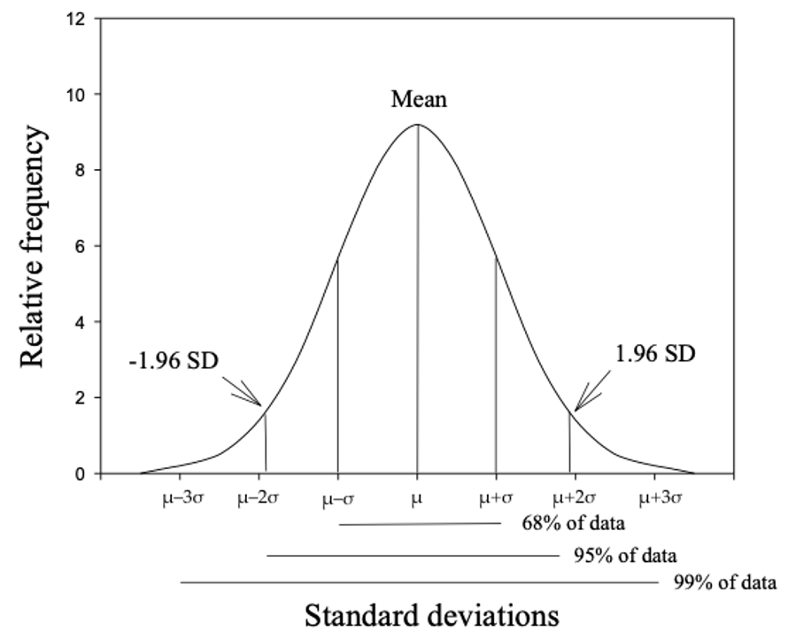

# Precision, standard errors and confidence intervals

## Learning objectives {.unnumbered}

By the end of this module you will be able to:

-   Explain the purpose of sampling, different sampling methods and their implications for data analysis;
-   Distinguish between standard deviation of a sample and standard error of a mean;
-   Recognise the importance of the central limit theorem;
-   Calculate the standard error of a mean;
-   Calculate and interpret confidence intervals for a mean;
-   Be familiar with the t-distribution and when to use it.

## Optional readings {.unnumbered}

@kirkwood_sterne01; Chapters 4 and 6. [\[UNSW Library Link\]](http://er1.library.unsw.edu.au/er/cgi-bin/eraccess.cgi?url=https://ebookcentral.proquest.com/lib/unsw/detail.action?docID=624728)

@bland15; Sections 3.3 and 3.4, 8.1 to 8.3. [\[UNSW Library Link\]](http://er1.library.unsw.edu.au/er/cgi-bin/eraccess.cgi?url=https://ebookcentral.proquest.com/lib/unsw/detail.action?docID=5891730)

## Introduction

To describe the characteristics of a population we can gather data about the entire population (as is undertaken in a national census) or we can gather data from a sample of the population. When undertaking a research study, taking a sample from a population is far more cost-effective and less time consuming than collecting information from the entire population. When a sample of a population is selected, summary statistics that describe the sample are used to make inferences about the total population from which the sample was drawn. These are referred to as inferential statistics.

However, for the inferences about the population to be valid, a random sample of the population must be obtained. The goal of using random sampling methods is to obtain a sample that is representative of the target population. In other words, apart from random error, the information derived from the sample is expected to be much the same as the information collected from a complete population census as long as the sample is large enough.

## Probability for continuous variables

Calculating the probability for a discrete random variable is relatively straightforward, as there are only a finite number of possible events. However, there are an infinite number of possible values for a continuous variable, and we calculate the probability that the continuous variable lies in a range of values.

## Normal distribution

The frequency plot for many biological and clinical measurements (for example blood pressure and height) follow a bell shape where the curve is symmetrical about the mean value and has tails at either end. @fig-2-1 [^03-precision-1] and @fig-2-2 [^03-precision-2] demonstrate this type of distribution.

[^03-precision-1]: Source: https://www.aihw.gov.au/reports/risk-factors/high-blood-pressure/contents/high-blood-pressure (accessed March 2021)

[^03-precision-2]: Source: https://ourworldindata.org/human-height (accessed March 2021)


::: {.cell}
::: {.cell-output-display}
{#fig-2-1 width=66%}
:::
:::


::: {.cell}
::: {.cell-output-display}
{#fig-2-2 width=66%}
:::
:::


The Normal distribution, also called the Gaussian distribution (named after Johann Carl Friedrich Gauss, 1777–1855), has been shown to fit the frequency distribution of many naturally occurring variables. It is characterised by its bell-shaped, symmetric curve and its tails that approach zero on either side.

There are two reasons for the importance of the Normal distribution in biostatistics (Kirkwood and Sterne, 2003). The first is that many variables can be modelled reasonably well using the Normal distribution. Even if the observed data were not Normally distributed, it can often be made reasonably Normal after applying some transformation of the data. The second (and possible most important) reason, is based on the central limit theorem and will be discussed in Module 3.

The Normal distribution is characterised by two parameters: the mean ($\mu$) and the standard deviation ($\sigma$). The mean defines where the middle of the Normal distribution is located, and the standard deviation defines how wide the tails of the distribution are.

For a Normal distribution, about 68% of the observations lie between $- \sigma$ and $\sigma$ of the mean; 95% of the observations lie between $−1.96 \times \sigma$ and $1.96 \times \sigma$ from the mean; and almost all the observations (99.7%) lie between $-3 \times \sigma$ and $3 \times \sigma$ (@fig-2-3). Also note that the mean is the same as the median, as the curve is symmetric about its mean.


::: {.cell}
::: {.cell-output-display}
{#fig-2-3 width=66%}
:::
:::


## The Standard Normal distribution

As each Normal distribution is defined by its mean and standard deviation, there are an infinite number of possible Normal distributions. However, every Normal distribution can be transformed to what we call the Standard Normal distribution, which has a mean of zero ($\mu = 0$) and a standard deviation of one ($\sigma = 1$). The Standard Normal distribution is so important that it has been assigned its own symbol: Z.

Every observation from a Normal distribution $X$ with a mean $\mu$ and a standard deviation $\sigma$ can be transformed to a z-score (also called a Standard Normal deviate) by the formula:

$$ z = \frac{x - \mu}{\sigma} $$

The z-score is simply how far an observation lies from the population mean value, scaled by the population standard deviation.

We can use z-scores to estimate probabilities, as shown in Worked Example 2.2.

#### Worked Example {.unnumbered}

This example extends the example of diastolic blood pressure shown in @fig-2-1. Assume that the mean diastolic blood pressure for men is 77.9 mmHg, with a standard deviation of 11. What is the probability that a man selected at random will have high blood pressure (i.e. diastolic blood pressure ≥ 90)?

To estimate the probability that diastolic blood pressure ≥ 90 (i.e. the upper tail probability), we first need to calculate the z-score that corresponds to 90 mmHg.

Using the z-score formula, with x=90, $\mu$=77.9 and $\sigma$=11:

$$ z = \frac{90 - 77.9}{11} = 1.1 $$ Thus, a blood pressure of 90 mmHg corresponds to a z-score of 1.1, or a value 1.1 $\times \sigma$ above the mean weight of the population.

@fig-2-5 shows the probability of a diastolic blood pressure of 90 mmHg or more in the population for a z-score of greater than 1.1 on a Standard Normal distribution.


::: {.cell}
::: {.cell-output-display}
{#fig-2-5 width=66%}
:::
:::


Using software, we find the probability that a person has a diastolic blood pressure of 90 mmHg or more as P(Z ≥ 1.1) = 0.136 (see @sec-normal-stata and @sec-normal-r for details).

Apart from calculating probabilities, z-scores are most useful for comparing measurements taken from a sample to a known population distribution. It allows measurements to be compared to one another despite being on different scales or having different predicted values.

For example, if we take a sample of children and measure their weights, it is useful to describe those weights as z-scores from the population weight distribution for each age and gender. Such distributions from large population samples are widely available. This allows us to describe a child’s weight in terms of how much it is above or below the population average. For example, if mean weights were compared, children aged 5 years would be on average heavier than the children aged 3 years simply because they are older and therefore larger. To make a valid comparison, we could use the Z-scores to say that children aged 3 years tend to be more overweight than children aged 5 years because they have a higher mean z-score for weight.

## Assessing Normality

There are several ways to assess whether a continuous variable is Normally distributed. With a large sample, simply plotting a histogram is one of the best ways to assess whether a variable is Normally distributed. For smaller samples, examining a histogram can be less clear, particularly for histograms with only a small number of bins. However, if a histogram looks bell-shaped and approximately symmetrical, assuming Normality would be reasonable.

It may be useful to examine a boxplot of a variable in conjunction with a histogram. However a boxplot in isolation is not as useful as a histogram, as a boxplot only indicates whether a variable is distributed symmetrically (indicated by equal "whiskers"). A boxplot cannot give an indication of whether the distribution is bell-shaped, or flat.

> For your information: There are formal tests in Stata and R that test for Normality. These tests are beyond the scope of this course and are not recommended.

The histogram for our 30 weights is approximately bell-shaped and roughly symmetrical. The mean and median (50th percentile) values are similar, as would be expected for a Normal distribution. Thus, it would be reasonable to assume that the data are Normally distributed.


::: {.cell}
::: {.cell-output-display}
{#fig-2-6 width=90%}
:::
:::


## Non-Normally distributed measurements

In the above example, diastolic blood pressure was Normally distributed with an approximately bell-shaped frequency histogram. However, not all measurements are Normally distributed, and the symmetry of the bell shape may be distorted by the presence of some very small or very large values. Non-Normal distributions such as this are called skewed distributions.

When there are some very large values, the distribution is said to be positively skewed.This often occurs when measuring variables related to time, such as days of hospital stay, where most patients have short stays (say 1 - 5 days) but a few patients with serious medical conditions have very long lengths of hospital stay (say 20 - 100 days).

In practice, most parametric summary statistics are quite robust to minor deviations from Normality and non-parametric statistical methods are only required when the sample size is small and/or the data are obviously skewed with some influential outliers.

When the data are markedly skewed, histograms and boxplots can look very different. For example, data of length of hospital stay in a sample of children are shown as a histogram and as a box plot in @fig-2-7.


::: {.cell}
::: {.cell-output-display}
{#fig-2-7 width=90%}
:::
:::


In the histogram of @fig-2-7, there is a tail of values to the right, so we would conclude that the distribution is skewed to the right. In the boxplot, the whiskers appear to be fairly symmetric, but there are some unusual values (denoted by dots) above the box and its whiskers. Stata defines these unusual values as being more than 1.5 times the IQR from the edge of the box.

The presence of unusual values may be an indication that the data are not Normally distributed. Both the histogram and the box plot show that the distribution has a marked tail towards high values and that non-parametric statistics should be used to generate summary statistics and analyse the data.

Note that Stata has defined points as being unusual, or outliers. Outliers can be problematic and the decision to include them or omit them from further analyses can be difficult. After detecting any outliers or extreme values, you should not automatically exclude them from the analysis, particularly if the sample was selected randomly from a population. First, it is important to check the original data collection form or questionnaire to rule out the possibility of a data entry error. If the outlier is not a data entry error, it is then important to decide whether the observation is biologically plausible and, if it is, it should be included in the analysis.

## Parametric and non-parametric statistical methods

Many statistical methods are based on assumptions about the distribution of the variable – these methods are known as parametric statistical methods. Many methods of statistical inferences based on theoretical sampling properties that are derived from a Normal distribution with the characteristics described above. Thus, it is important that measurements approximate to a Normal distribution before these parametric methods are used. The methods are called ‘parametric’ because they are based on the parameters – the mean and standard deviation - that underlie a Normal distribution. Statistics which do not assume a particular distribution are called distribution-free statistics, or ‘non-parametric statistics’.

In this course, you will learn about both parametric and non-parametric statistical methods. Parametric summary statistical methods include those based on the mean, standard deviation and range (Module 1), and standard error and 95% confidence interval (Module 3). Parametric statistical tests also include t-tests which will be covered in Modules 4 and 5, and correlation and regression described in Module 8.

Non-parametric summary statistical methods are often based on ranks, and may use such statistics as the median, mode and inter-quartile range (Module 1). Non-parametric statistical tests that use ranking are described in Module 9.

## Other types of probability distributions

In this module we have considered a Normal probability distribution and how to use it to measure the precision of continuously distributed measurements. Data also follow other types of distributions which are briefly described below. In other modules in this course, we will be looking at a range of methods to analyse health data and will refer back to these different distributions.

Normal approximation of binomial: When the sample size becomes large, it becomes cumbersome to calculate the exact probability of an event using the binomial distribution. Conveniently, with large sample sizes, the binomial distribution approximates a Normal distribution. The mean and SD of a binomial distribution can be used to calculate the probability of the event as though it was from a Normal distribution.

Poisson distribution: is another distribution which is often used in health research for modelling count data. The Poisson distribution is followed when a number of events happen in a fixed time interval. This distribution is useful for describing data such as deaths in the population in a time period. For example, the number of deaths from breast cancer in one year in women over 50 years old will be an observation from a Poisson distribution. We can also use this to make comparisons of mortality rates between populations.

Many other probability distributions can be derived for functions which arise in statistical analyses but the chi-squared, t and F distributions are the three distributions that are most widely used. These have many applications, some of which are described in later modules.

The chi-squared distribution is a skewed distribution which allows us to determine the probability of a deviation between a count that we observe and a count that we expect for categorical data. One use of this is in conducting statistical tests for categorical data. See Module 7.

A t-distribution is used when the population standard deviation is not known. The t-distribution is appropriate for small samples (\<30) and its distribution is bell shaped similar to a Normal distribution but slightly flatter. The t-distribution is useful for comparing mean values. See Module 4 and Module 5.

## Sampling methods

Methods have been designed to select participants from a population such that each person in the target population has an equal probability of being chosen. Methods that use this approach are called random sampling methods. Examples include simple random sampling and stratified random sampling.

In simple random sampling, every person in the population from which the sample is drawn has the same random chance of being selected into the sample. To implement this method, every person in the population is allocated an ID number and then a random sample of the ID numbers is selected. Software packages can be used to generate a list of random numbers to select the random sample.

In stratified sampling, the population is divided into distinct non-overlapping subgroups (strata) according to an important characteristic (e.g. age or sex) and then a random sample is selected from each of the strata. This method is used to ensure that sufficient numbers of people are sampled from each stratum and therefore each subgroup of interest is adequately represented in the sample.

The purpose of using random sampling is to minimise selection bias to ensure that the sample enrolled in a study is representative of the population being studied. This is important because the summary statistics that are obtained can then be regarded as valid in that they can be applied (generalised) back to the population.

A non-representative sample might occur when random sampling is used, simply by chance. However, non-random sampling methods, such as using a study population that does not represent the whole population, will often result in a non-representative sample being selected so that the summary statistics from the sample cannot be generalised back to the population from which the participants were drawn. The effects of non-random error are much more serious than the effects of random error. Concepts such as non-random error (i.e. systematic bias), selection bias, validity and generalisability are discussed in more detail in PHCM9796: Foundations of Epidemiology.

## Standard error and precision

Module 1 introduced the mean, variance and standard deviation as measures of central tendency and spread for continuous measurements from a sample or a population. As described in Module 1, we rarely have data on the entire population but we *infer* information *about* the population from a *sample*. For example, we use the sample mean $\bar x$ as an *estimate* of the true population mean $\mu$.

However, a sample taken from a population is usually a small proportion of the total population. If we were to take multiple samples of data and calculate the sample mean for each sample, we would not expect them to be identical. If our samples were very small, we would not be surprised if our estimated sample means were somewhat different from each other. However, if our samples were large, we would expect the sample means to be less variable, i.e. the estimated sample means would be more close to each other, and hopefully, to the true population mean.

### The standard error of the mean {#sec-semean}

A point estimate is a single best guess of the true value in the population - taken from our sample of data. Different samples will provide slightly different point estimates. The standard error is a measure of variability of the point estimate.

In particular, the *standard error of the mean* measures the extent to which we expect the means from different samples to vary because of chance due to the sampling process. This statistic is directly proportional to the standard deviation of the variable, and inversely proportional to the size of the sample. The standard error of the mean for a continuously distributed measurement for which the SD is an accurate measure of spread is computed as follows:

$$ \text{SE}(\bar{x}) = \frac{\text{SD}}{\sqrt{n}} $$

Take for example, a set of weights of students attending a university gym in a particular hour. The thirty weights are given below:


::: {#tbl-3-weights .cell tbl-cap='Weight of 30 gym attendees'}
::: {.cell-output-display}

```{=latex}
\global\setlength{\Oldarrayrulewidth}{\arrayrulewidth}

\global\setlength{\Oldtabcolsep}{\tabcolsep}

\setlength{\tabcolsep}{2pt}

\renewcommand*{\arraystretch}{1.5}


\providecommand{\ascline}[3]{\noalign{\global\arrayrulewidth #1}\arrayrulecolor[HTML]{#2}\cline{#3}}

\begin{longtable}[c]{|p{0.75in}|p{0.75in}|p{0.75in}|p{0.75in}|p{0.75in}|p{0.75in}}


\ascline{1.5pt}{666666}{1-6}

\multicolumn{1}{>{\raggedleft}m{\dimexpr 0.75in+0\tabcolsep}}{\textcolor[HTML]{000000}{\fontsize{11}{11}\selectfont{\global\setmainfont{Helvetica}{v1}}}} & \multicolumn{1}{>{\raggedleft}m{\dimexpr 0.75in+0\tabcolsep}}{\textcolor[HTML]{000000}{\fontsize{11}{11}\selectfont{\global\setmainfont{Helvetica}{v2}}}} & \multicolumn{1}{>{\raggedleft}m{\dimexpr 0.75in+0\tabcolsep}}{\textcolor[HTML]{000000}{\fontsize{11}{11}\selectfont{\global\setmainfont{Helvetica}{v3}}}} & \multicolumn{1}{>{\raggedleft}m{\dimexpr 0.75in+0\tabcolsep}}{\textcolor[HTML]{000000}{\fontsize{11}{11}\selectfont{\global\setmainfont{Helvetica}{v4}}}} & \multicolumn{1}{>{\raggedleft}m{\dimexpr 0.75in+0\tabcolsep}}{\textcolor[HTML]{000000}{\fontsize{11}{11}\selectfont{\global\setmainfont{Helvetica}{v5}}}} & \multicolumn{1}{>{\raggedleft}m{\dimexpr 0.75in+0\tabcolsep}}{\textcolor[HTML]{000000}{\fontsize{11}{11}\selectfont{\global\setmainfont{Helvetica}{v6}}}} \\

\ascline{1.5pt}{666666}{1-6}\endfirsthead 

\ascline{1.5pt}{666666}{1-6}

\multicolumn{1}{>{\raggedleft}m{\dimexpr 0.75in+0\tabcolsep}}{\textcolor[HTML]{000000}{\fontsize{11}{11}\selectfont{\global\setmainfont{Helvetica}{v1}}}} & \multicolumn{1}{>{\raggedleft}m{\dimexpr 0.75in+0\tabcolsep}}{\textcolor[HTML]{000000}{\fontsize{11}{11}\selectfont{\global\setmainfont{Helvetica}{v2}}}} & \multicolumn{1}{>{\raggedleft}m{\dimexpr 0.75in+0\tabcolsep}}{\textcolor[HTML]{000000}{\fontsize{11}{11}\selectfont{\global\setmainfont{Helvetica}{v3}}}} & \multicolumn{1}{>{\raggedleft}m{\dimexpr 0.75in+0\tabcolsep}}{\textcolor[HTML]{000000}{\fontsize{11}{11}\selectfont{\global\setmainfont{Helvetica}{v4}}}} & \multicolumn{1}{>{\raggedleft}m{\dimexpr 0.75in+0\tabcolsep}}{\textcolor[HTML]{000000}{\fontsize{11}{11}\selectfont{\global\setmainfont{Helvetica}{v5}}}} & \multicolumn{1}{>{\raggedleft}m{\dimexpr 0.75in+0\tabcolsep}}{\textcolor[HTML]{000000}{\fontsize{11}{11}\selectfont{\global\setmainfont{Helvetica}{v6}}}} \\

\ascline{1.5pt}{666666}{1-6}\endhead


\multicolumn{1}{>{\raggedleft}m{\dimexpr 0.75in+0\tabcolsep}}{\textcolor[HTML]{000000}{\fontsize{11}{11}\selectfont{\global\setmainfont{Helvetica}{65}}}} & \multicolumn{1}{>{\raggedleft}m{\dimexpr 0.75in+0\tabcolsep}}{\textcolor[HTML]{000000}{\fontsize{11}{11}\selectfont{\global\setmainfont{Helvetica}{70.0}}}} & \multicolumn{1}{>{\raggedleft}m{\dimexpr 0.75in+0\tabcolsep}}{\textcolor[HTML]{000000}{\fontsize{11}{11}\selectfont{\global\setmainfont{Helvetica}{70.0}}}} & \multicolumn{1}{>{\raggedleft}m{\dimexpr 0.75in+0\tabcolsep}}{\textcolor[HTML]{000000}{\fontsize{11}{11}\selectfont{\global\setmainfont{Helvetica}{67.5}}}} & \multicolumn{1}{>{\raggedleft}m{\dimexpr 0.75in+0\tabcolsep}}{\textcolor[HTML]{000000}{\fontsize{11}{11}\selectfont{\global\setmainfont{Helvetica}{65.0}}}} & \multicolumn{1}{>{\raggedleft}m{\dimexpr 0.75in+0\tabcolsep}}{\textcolor[HTML]{000000}{\fontsize{11}{11}\selectfont{\global\setmainfont{Helvetica}{80.0}}}} \\


\multicolumn{1}{>{\raggedleft}m{\dimexpr 0.75in+0\tabcolsep}}{\textcolor[HTML]{000000}{\fontsize{11}{11}\selectfont{\global\setmainfont{Helvetica}{70}}}} & \multicolumn{1}{>{\raggedleft}m{\dimexpr 0.75in+0\tabcolsep}}{\textcolor[HTML]{000000}{\fontsize{11}{11}\selectfont{\global\setmainfont{Helvetica}{72.5}}}} & \multicolumn{1}{>{\raggedleft}m{\dimexpr 0.75in+0\tabcolsep}}{\textcolor[HTML]{000000}{\fontsize{11}{11}\selectfont{\global\setmainfont{Helvetica}{67.5}}}} & \multicolumn{1}{>{\raggedleft}m{\dimexpr 0.75in+0\tabcolsep}}{\textcolor[HTML]{000000}{\fontsize{11}{11}\selectfont{\global\setmainfont{Helvetica}{62.5}}}} & \multicolumn{1}{>{\raggedleft}m{\dimexpr 0.75in+0\tabcolsep}}{\textcolor[HTML]{000000}{\fontsize{11}{11}\selectfont{\global\setmainfont{Helvetica}{67.5}}}} & \multicolumn{1}{>{\raggedleft}m{\dimexpr 0.75in+0\tabcolsep}}{\textcolor[HTML]{000000}{\fontsize{11}{11}\selectfont{\global\setmainfont{Helvetica}{72.5}}}} \\


\multicolumn{1}{>{\raggedleft}m{\dimexpr 0.75in+0\tabcolsep}}{\textcolor[HTML]{000000}{\fontsize{11}{11}\selectfont{\global\setmainfont{Helvetica}{60}}}} & \multicolumn{1}{>{\raggedleft}m{\dimexpr 0.75in+0\tabcolsep}}{\textcolor[HTML]{000000}{\fontsize{11}{11}\selectfont{\global\setmainfont{Helvetica}{65.0}}}} & \multicolumn{1}{>{\raggedleft}m{\dimexpr 0.75in+0\tabcolsep}}{\textcolor[HTML]{000000}{\fontsize{11}{11}\selectfont{\global\setmainfont{Helvetica}{72.5}}}} & \multicolumn{1}{>{\raggedleft}m{\dimexpr 0.75in+0\tabcolsep}}{\textcolor[HTML]{000000}{\fontsize{11}{11}\selectfont{\global\setmainfont{Helvetica}{77.5}}}} & \multicolumn{1}{>{\raggedleft}m{\dimexpr 0.75in+0\tabcolsep}}{\textcolor[HTML]{000000}{\fontsize{11}{11}\selectfont{\global\setmainfont{Helvetica}{75.0}}}} & \multicolumn{1}{>{\raggedleft}m{\dimexpr 0.75in+0\tabcolsep}}{\textcolor[HTML]{000000}{\fontsize{11}{11}\selectfont{\global\setmainfont{Helvetica}{75.0}}}} \\


\multicolumn{1}{>{\raggedleft}m{\dimexpr 0.75in+0\tabcolsep}}{\textcolor[HTML]{000000}{\fontsize{11}{11}\selectfont{\global\setmainfont{Helvetica}{75}}}} & \multicolumn{1}{>{\raggedleft}m{\dimexpr 0.75in+0\tabcolsep}}{\textcolor[HTML]{000000}{\fontsize{11}{11}\selectfont{\global\setmainfont{Helvetica}{70.0}}}} & \multicolumn{1}{>{\raggedleft}m{\dimexpr 0.75in+0\tabcolsep}}{\textcolor[HTML]{000000}{\fontsize{11}{11}\selectfont{\global\setmainfont{Helvetica}{67.5}}}} & \multicolumn{1}{>{\raggedleft}m{\dimexpr 0.75in+0\tabcolsep}}{\textcolor[HTML]{000000}{\fontsize{11}{11}\selectfont{\global\setmainfont{Helvetica}{77.5}}}} & \multicolumn{1}{>{\raggedleft}m{\dimexpr 0.75in+0\tabcolsep}}{\textcolor[HTML]{000000}{\fontsize{11}{11}\selectfont{\global\setmainfont{Helvetica}{67.5}}}} & \multicolumn{1}{>{\raggedleft}m{\dimexpr 0.75in+0\tabcolsep}}{\textcolor[HTML]{000000}{\fontsize{11}{11}\selectfont{\global\setmainfont{Helvetica}{62.5}}}} \\


\multicolumn{1}{>{\raggedleft}m{\dimexpr 0.75in+0\tabcolsep}}{\textcolor[HTML]{000000}{\fontsize{11}{11}\selectfont{\global\setmainfont{Helvetica}{75}}}} & \multicolumn{1}{>{\raggedleft}m{\dimexpr 0.75in+0\tabcolsep}}{\textcolor[HTML]{000000}{\fontsize{11}{11}\selectfont{\global\setmainfont{Helvetica}{62.5}}}} & \multicolumn{1}{>{\raggedleft}m{\dimexpr 0.75in+0\tabcolsep}}{\textcolor[HTML]{000000}{\fontsize{11}{11}\selectfont{\global\setmainfont{Helvetica}{70.0}}}} & \multicolumn{1}{>{\raggedleft}m{\dimexpr 0.75in+0\tabcolsep}}{\textcolor[HTML]{000000}{\fontsize{11}{11}\selectfont{\global\setmainfont{Helvetica}{75.0}}}} & \multicolumn{1}{>{\raggedleft}m{\dimexpr 0.75in+0\tabcolsep}}{\textcolor[HTML]{000000}{\fontsize{11}{11}\selectfont{\global\setmainfont{Helvetica}{72.5}}}} & \multicolumn{1}{>{\raggedleft}m{\dimexpr 0.75in+0\tabcolsep}}{\textcolor[HTML]{000000}{\fontsize{11}{11}\selectfont{\global\setmainfont{Helvetica}{70.0}}}} \\

\ascline{1.5pt}{666666}{1-6}


\end{longtable}


\arrayrulecolor[HTML]{000000}

\global\setlength{\arrayrulewidth}{\Oldarrayrulewidth}

\global\setlength{\tabcolsep}{\Oldtabcolsep}

\renewcommand*{\arraystretch}{1}
```

:::
:::


We can calculate the mean (70.0kg) and the standard deviation (5.04kg). Hence, the standard error of the mean is estimated as:

$$ \text{SE}(\bar{x}) = \frac{5.04}{\sqrt{30}} = 0.92 $$ Because the calculation uses the sample size (n) (i.e. the number of study participants) in the denominator, the SE will become smaller when the sample size becomes larger. A smaller SE indicates that the estimated mean value is more precise.

The standard error is an important statistic that is related to sampling variation. When a random sample of a population is selected, it is likely to differ in some characteristic compared with another random sample selected from the same population. Also, when a sample of a population is taken, the true population mean is an unknown value.

Just as the standard deviation measures the spread of the data around the population mean, the standard error of the mean measures the spread of the sample means. Note that we do not have different samples, only one. It is a theoretical concept which enables us to conduct various other statistical analyses.

## Central limit theorem

Even though we now have an estimate of the mean and its standard error, we might like to know what the mean from a different random sample of the same size might be. To do this, we need to know how sample means are distributed. In determining the form of the probability distribution of the sample mean ($\bar{x}$), we consider two cases:

### When the population distribution is unknown:

The central limit theorem for this situation states:

> In selecting random samples of size $n$ from a population with mean $\mu$ and standard deviation $\sigma$, the sampling distribution of the sample mean $\bar{x}$ approaches a normal distribution with mean $\mu$ and standard deviation $\tfrac{\sigma}{\sqrt{n}}$ as the sample size becomes large.

The sample size n = 30 and above is a rule of thumb for the central limit theorem to be used. However, larger sample sizes may be needed if the distribution is highly skewed.

### When the population is assumed to be normal:

> In this case the sampling distribution of $\bar{x}$ is normal for any sample size.

## 95% confidence interval of the mean

In Module 2, we showed that the characteristics of a Standard Normal Distribution are that 95% of the data lie within 1.96 standard deviations from the mean (@fig-2-2). Because the central limit theorem states that the sampling distribution of the mean is approximately Normal in large enough samples, we expect that 95% of the mean values would fall within 1.96 × SE units above and below the measured mean population value.

For example, if we repeated the study on weight 100 times using 100 different random samples from the population and calculated the mean weight for each of the 100 samples, approximately 95% of the values for the mean weight calculated for each of the 100 samples would fall within 1.96 × SE of the population mean weight.

This interpretation of the SE is translated into the concept of precision as a 95% confidence interval (CI). A 95% CI is a range of values within which we have 95% confidence that the true population mean lies. If an experiment was conducted a very large number of times, and a 95%CI was calculated for each experiment, 95% of the confidence intervals would contain the true population mean.

The calculation of the 95% CI for a mean is as follows:

$$  \bar{x} \pm 1.96 \times \text{SE}( \bar{x} ) $$ This is the generic formula for calculating 95% CI for any summary statistic. In general, the mean value can be replaced by the point estimate of a rate or a proportion and the same formula applies for computing 95% CIs, i.e.

$$ 95\% \text{ CI} = \text{point estimate} \pm 1.96 \times \text{SE}(\text{point estimate)} $$

The main difference in the methods used to calculate the 95% CI for different point estimates is the way the SE is calculated. The methods for calculating 95% CI around proportions and other ratio measures will be discussed in Module 6.

The use of 1.96 as a general critical value to compute the 95% CI is determined by sampling theory. For the confidence interval of the mean, the critical value (1.96) is based on normal distribution (true when the population SD is known). However, in practice, statistical packages will provide slightly different confidence intervals because they use a critical value obtained from the t-distribution. The t-distribution approaches a normal distribution when the sample size approaches infinity, and is close to a normal distribution when the sample size is ≥30.The critical values obtained from the t-distribution are always larger than the corresponding critical value from the normal distribution. The difference gets smaller as the sample size becomes larger. For example, when the sample size n=10, the critical value from the t-distribution is 2.26 (rather than 1.96); when n= 30, the value is 2.05; when n=100, the value is 1.98; and when n=1000, the critical value is 1.96.

The critical value multiplied by SE (for normal distribution, 1.96 × SE) is called the maximum likely error for 95% confidence.

### The t-distribution and when should I use it?

The population standard deviation ($\sigma$) is required for calculation of the standard error. Usually, $\sigma$ is not known and the sample standard deviation ($s$) is used to estimate it. It is known, however, that the sample standard deviation of a normally distributed variable underestimates the true value of $\sigma$, particularly when the sample size is small.

Someone by the pseudonym of Student came up with the Student’s t distribution with ($n-1$) degrees of freedom to account for this underestimation. It looks very much like the standardised normal distribution, only that it has fatter tails (@fig-mod03-z-t-dist). As the degrees of freedom increase (i.e. as $n$ increases), the t-distribution gradually approaches the standard normal distribution. With a sufficiently large sample size, the Student’s t-distribution closely approximates the standardised normal distribution.


::: {.cell}
::: {.cell-output-display}
{#fig-mod03-z-t-dist width=100%}
:::
:::


If a variable $X$ is normally distributed and the population standard deviation $\sigma$ is known, using the normal distribution is appropriate. However, if $\sigma$ is not known then one should use the student t-distribution with ($n – 1$) degrees of freedom.

### Worked Example 3.1: 95% CI of a mean using individual data

The diastolic blood pressure of 733 female Pima indigenous Americans was measured, and a density plot showed that the data were approximately normally distributed. The mean diastolic blood pressure in the sample was 72.4 mmHg with a standard deviation of 12.38 mmHg. These data are saved as `mod03_blood_pressure.csv`.

Use Jamovi or R, we can calculate the mean, its Standard Error, and the 95% confidence interval:

| n | Mean | Standard deviation | Standard error of the mean | 95% confidence interval of the mean |
|------------|------------|------------|------------|-------------------------|
| 733 | 72.4 | 12.38 | 0.46 | 71.5 to 73.3 |

: Summary of blood pressure from female Pima indigenous Americans {#tbl-mean-ci}

We can interpret this confidence interval as: we are 95% confident that the true mean of female Pima indigenous Americans lies between 71.5 and 73.3 mmHg.

### Worked Example 3.2: 95% CI of a mean using summarised data

The publication of a study using a sample of 242 participants reported a sample mean systolic blood pressure of 128.4 mmHg and a sample standard deviation of 19.56 mmHg. Find the 95% confidence interval for the mean systolic blood pressure.

Using Jamovi or R, we obtain a 95% confidence interval from 125.9232 to 130.8768.

We are 95% confident that the true mean systolic blood pressure of the population from which the sample was drawn lies between 125.9 kg and 130.9 mmHg.

<!--  -->

<!-- # Jamovi notes {.unnumbered} -->

<!--  -->

<!--  -->

<!-- # R notes {.unnumbered} -->

<!--  -->

<!--  -->

<!-- # Activities {.unnumbered} -->

<!--  -->