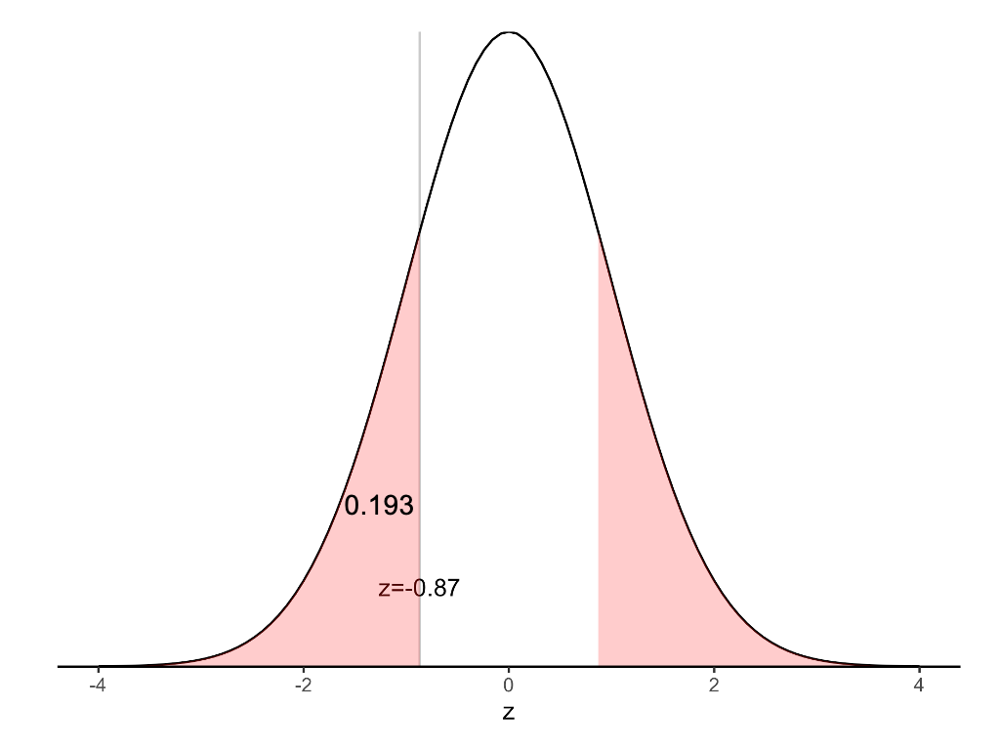

# Summary statistics for binary data

## Learning objectives {-}

By the end of this module you will be able to:

- Compute and interpret 95% confidence intervals for proportions;
- Conduct and interpret a significance test for a one-sample proportion;
- Use statistical software to compute 95% confidence intervals for a difference in proportions, a relative risk and an odds ratio.

## Optional readings {-}

@kirkwood_sterne01; Chapter 16 [[UNSW Library Link]](http://er1.library.unsw.edu.au/er/cgi-bin/eraccess.cgi?url=https://ebookcentral.proquest.com/lib/unsw/detail.action?docID=624728)

@bland15; Section 8.6, Section 13.7 [[UNSW Library Link]](http://er1.library.unsw.edu.au/er/cgi-bin/eraccess.cgi?url=https://ebookcentral.proquest.com/lib/unsw/detail.action?docID=5891730)

@acock10; Section 7.5.

## Introduction

In Modules 4 and 5, we discussed methods used to test hypotheses when the data are continuous. In Modules 6 and 7, we will focus on hypothesis testing for binary categorical data.

In health research, we often collect information that can be put into two categories, e.g. male and female, disease present or disease absent etc. Binary categorical variables such as these are summarised using proportions.

## Calculating proportions and 95% confidence intervals

### Calculating a proportion

We need two pieces of information to calculate a proportion: $n$, the number of trials, and $k$, the number of 'successes'. Note that we use the term 'success' to describe the outcome of interest, recognising that a success may be a adverse outcome such as death or disease.

The following formula is used to calculate the proportion, $p$:

$$ p = k / n $$

The proportion, $p$, is a number that lies between 0 and 1. Proportions and their confidence intervals can easily be converted to percentages by multiplying by 100 once computed.

As for all summary statistics, it is useful to compute the precision of the estimate as a 95% confidence interval (CI) to indicate the range of values in which are 95% confident that the true population value lies. In this module, we present two methods for computing a 95% confidence interval around a proportion.

### Calculating the 95% confidence interval of a proportion (Wald method)

The Wald method for calculating the 95% confidence interval is based on assuming that the proportion, $p$, is Normally distributed. This assumption is reasonable if the sample is sufficiently large (for example, if $n>30$) and if $n \times (1-p)$ and $n \times p$ are both larger than 5.

The Wald method for calculating a 95% confidence interval is given by:

$$\text{95\% CI} = p \pm (1.96 \times \text{SE}(p))$$

where the standard error of a proportion is computed as:

$$\text{SE}(p) = \sqrt{\frac{p \times (1 - p)}{n}}$$

### Worked Example 6.1

In a cross-sectional study of children living in a rural village, 47 children from a random sample of 215 children were found to have scabies. Here $n=215$ and $k=47$, so the proportion of children with scabies is estimated as:

$$ p = \frac{47}{215} = 0.2186 $$

Given the large sample size and the number of children with the rarer outcome is larger than 5, the Wald method is used to calculate the standard error of the proportion as:

$${\text{SE}\left( p \right) = \sqrt{\frac{0.2186 \times (1 - 0.2186)}{215}}
}{= 0.02819}$$

Then, the 95% confidence interval is estimated as:

$$\text{95\% CI} = 0.2186 \pm 1.96 \times 0.02819$$

$$= 0.1634 \text{ to } 0.2739$$

The prevalence of scabies among children in the village is 21.9% (95% CI 16.3%, 27.4%). These values tell us that we are 95% confident that the true prevalence of scabies among children in the village is between 16.3% and 27.4%.

### Calculating the 95% confidence interval of a proportion (Wilson method)

Another method to calculate the confidence interval of a proportion is the Wilson (sometimes also called the 'score') method. We can use it in situations where it is not appropriate to use the normal approximation to the binomial distribution as described above i.e. if the sample size is small ($n < 30$) or the number of subjects with the rarer outcome is 5 or fewer. This method much more difficult to implement by hand than the standard confidence interval, and so we will not discuss the hand calculation using the mathematical equation in this course. Instead, we use statistical software to do this (see the Stata or R notes for detail).

When using software, our worked example provides a 95% confidence interval of the prevalence of scabies of 16.9% to 27.9%.

### Wald vs Wilson methods

The Wald method, which assumes that the underlying proportion follows a Normal distribution, is easy to calculate and follows the form of other confidence intervals. The Wilson method, which is difficult to calculate by hand, has nicer mathematical properties. There are also a number of other methods for calculating confidence intervals for proportions, but we do not discuss these in this course.

A paper by Brown, Cai and DasGupta (@brown_etal01) has compared the properties of the Wald and Wilson methods (among others) and concluded that the Wilson method is preferred over the Wald method. **Therefore, we recommend the Wilson method be used to calculate 95% confidence intervals for a proportion.**

## Hypothesis testing for one sample proportion

We can carry out a hypothesis test to compare a sample proportion to a hypothesised proportion. In much the same way as a one sample t-test was used in Module 5 to test a sample mean against a hypothesised mean, we can perform a one-sample test to test a sample proportion against a hypothesised proportion. The significance test will provide a P-value to assess the evidence against the null hypothesis, while the 95% confidence interval will provide the range in which we are 95% confident that the true proportion lies.

For example, we can test the following null hypothesis:

  H~0~: sample proportion is not different from the hypothesised proportion

Much like constructing a 95% confidence interval, there are two main options when performing a hypothesis test on a single proportion: the first assumes that the proportion follows a Normal distribution, while the second relaxes this assumption.

### z-test for testing one sample proportion

The first step in the z-test is to calculate a z-statistic, which is then used to calculate a P-value. The z-statistic is calculated as the difference between the population proportion and the sample proportion divided by the standard error of the population proportion, i.e.

$$
z = \frac{(p_{sample} - p_{population})}{\text{SE}(p_{population})}
$$

This z-statistic is then compared to the standard Normal distribution to calculate the P-value.

### Worked Example 6.2 {#z-prop-example}

A national census in a country shows that 20% of the population are smokers. A survey of a community within the country that has received a public health anti-smoking intervention shows that 54 of 300 people sampled are smokers (18%). We can calculate a 95% confidence interval around this proportion using the Wilson method, which is calculated as 14.1% to 22.7%.

The researchers are interested in whether the proportion of smoking in this community is the same as the population prevalence of smoking of 20%. The null hypothesis can be written as: H~0~: the proportion of smokers in the community is 20% (the same as in the national census).

We can test this by calculating a z-statistic:

$$
\begin{aligned}
z &= \frac{(0.18 - 0.20)}{\sqrt{\frac{0.20 × (1 - 0.20)}{300}}} \\
 &= -0.87
\end{aligned}
$$

The P-value for the test above can be obtained from a Normal distribution table as $P = 2 × 0.192 = 0.38$ (using Table A2.1 in the Appendix), or using the hand-calculator in Stata. This indicates that there is insufficient evidence to conclude that there is a difference between the proportion of smokers in the community and the country. This is consistent with our 95% confidence interval which crosses the null value of 20%.


::: {.cell}
::: {.cell-output-display}
{width=66%}
:::
:::


### Binomial test for testing one sample proportion

We can use the binomial distribution to obtain an exact P-value for testing a single proportion. Historically, this was a time consuming process with much hand calculation. These days, statistical software performs the calculations quickly and efficiently, and is the preferred method.

### Worked example 6.3
The file `mod06_smoking_status.csv` contains the data for this example. In the data file, smokers are coded as 1 and non-smokers are coded as 0.

In Stata, we can use the `prtest` command to perform a z-test, or the `bitest` command to perform the exact binomial test. In R, we can use the `prop.test` function to perform a z-test, or the `binom.test` function to perform the exact binomial test.

The z-test provides a two-sided P-value of 0.39, while the binomial test gives a two-sided P-value of 0.43. Both tests provide little evidence against the hypothesis that the prevalence of smoking in the community is 20%.

## Contingency tables

As introduced in PHCM9794: Foundations of Epidemiology, 2-by-2 contingency tables can be used to examine associations between two binary variables, most commonly an exposure and an outcome. The traditional form of a 2-by-2 contigency table is given in @tbl-2-by-2-trad.


::: {#tbl-2-by-2-trad .cell tbl-cap='Traditional format for presenting a contingency table'}
::: {.cell-output-display}

```{=latex}
\global\setlength{\Oldarrayrulewidth}{\arrayrulewidth}

\global\setlength{\Oldtabcolsep}{\tabcolsep}

\setlength{\tabcolsep}{2pt}

\renewcommand*{\arraystretch}{1.5}


\providecommand{\ascline}[3]{\noalign{\global\arrayrulewidth #1}\arrayrulecolor[HTML]{#2}\cline{#3}}

\begin{longtable}[c]{|p{0.75in}|p{0.75in}|p{0.75in}|p{0.75in}}


\ascline{1.5pt}{666666}{1-4}

\multicolumn{1}{>{\raggedright}m{\dimexpr 0.75in+0\tabcolsep}}{\textcolor[HTML]{000000}{\fontsize{11}{11}\selectfont{\global\setmainfont{Helvetica}{\ }}}} & \multicolumn{1}{>{\raggedright}m{\dimexpr 0.75in+0\tabcolsep}}{\textcolor[HTML]{000000}{\fontsize{11}{11}\selectfont{\global\setmainfont{Helvetica}{Outcome\ present}}}} & \multicolumn{1}{>{\raggedright}m{\dimexpr 0.75in+0\tabcolsep}}{\textcolor[HTML]{000000}{\fontsize{11}{11}\selectfont{\global\setmainfont{Helvetica}{Outcome\ absent}}}} & \multicolumn{1}{>{\raggedright}m{\dimexpr 0.75in+0\tabcolsep}}{\textcolor[HTML]{000000}{\fontsize{11}{11}\selectfont{\global\setmainfont{Helvetica}{Total}}}} \\

\ascline{1.5pt}{666666}{1-4}\endfirsthead 

\ascline{1.5pt}{666666}{1-4}

\multicolumn{1}{>{\raggedright}m{\dimexpr 0.75in+0\tabcolsep}}{\textcolor[HTML]{000000}{\fontsize{11}{11}\selectfont{\global\setmainfont{Helvetica}{\ }}}} & \multicolumn{1}{>{\raggedright}m{\dimexpr 0.75in+0\tabcolsep}}{\textcolor[HTML]{000000}{\fontsize{11}{11}\selectfont{\global\setmainfont{Helvetica}{Outcome\ present}}}} & \multicolumn{1}{>{\raggedright}m{\dimexpr 0.75in+0\tabcolsep}}{\textcolor[HTML]{000000}{\fontsize{11}{11}\selectfont{\global\setmainfont{Helvetica}{Outcome\ absent}}}} & \multicolumn{1}{>{\raggedright}m{\dimexpr 0.75in+0\tabcolsep}}{\textcolor[HTML]{000000}{\fontsize{11}{11}\selectfont{\global\setmainfont{Helvetica}{Total}}}} \\

\ascline{1.5pt}{666666}{1-4}\endhead


\multicolumn{1}{>{\raggedright}m{\dimexpr 0.75in+0\tabcolsep}}{\textcolor[HTML]{000000}{\fontsize{11}{11}\selectfont{\global\setmainfont{Helvetica}{Exposure\ present}}}} & \multicolumn{1}{>{\raggedright}m{\dimexpr 0.75in+0\tabcolsep}}{\textcolor[HTML]{000000}{\fontsize{11}{11}\selectfont{\global\setmainfont{Helvetica}{a}}}} & \multicolumn{1}{>{\raggedright}m{\dimexpr 0.75in+0\tabcolsep}}{\textcolor[HTML]{000000}{\fontsize{11}{11}\selectfont{\global\setmainfont{Helvetica}{b}}}} & \multicolumn{1}{>{\raggedright}m{\dimexpr 0.75in+0\tabcolsep}}{\textcolor[HTML]{000000}{\fontsize{11}{11}\selectfont{\global\setmainfont{Helvetica}{a+b}}}} \\


\multicolumn{1}{>{\raggedright}m{\dimexpr 0.75in+0\tabcolsep}}{\textcolor[HTML]{000000}{\fontsize{11}{11}\selectfont{\global\setmainfont{Helvetica}{Exposure\ absent}}}} & \multicolumn{1}{>{\raggedright}m{\dimexpr 0.75in+0\tabcolsep}}{\textcolor[HTML]{000000}{\fontsize{11}{11}\selectfont{\global\setmainfont{Helvetica}{c}}}} & \multicolumn{1}{>{\raggedright}m{\dimexpr 0.75in+0\tabcolsep}}{\textcolor[HTML]{000000}{\fontsize{11}{11}\selectfont{\global\setmainfont{Helvetica}{d}}}} & \multicolumn{1}{>{\raggedright}m{\dimexpr 0.75in+0\tabcolsep}}{\textcolor[HTML]{000000}{\fontsize{11}{11}\selectfont{\global\setmainfont{Helvetica}{c+d}}}} \\


\multicolumn{1}{>{\raggedright}m{\dimexpr 0.75in+0\tabcolsep}}{\textcolor[HTML]{000000}{\fontsize{11}{11}\selectfont{\global\setmainfont{Helvetica}{Total}}}} & \multicolumn{1}{>{\raggedright}m{\dimexpr 0.75in+0\tabcolsep}}{\textcolor[HTML]{000000}{\fontsize{11}{11}\selectfont{\global\setmainfont{Helvetica}{a+c}}}} & \multicolumn{1}{>{\raggedright}m{\dimexpr 0.75in+0\tabcolsep}}{\textcolor[HTML]{000000}{\fontsize{11}{11}\selectfont{\global\setmainfont{Helvetica}{b+d}}}} & \multicolumn{1}{>{\raggedright}m{\dimexpr 0.75in+0\tabcolsep}}{\textcolor[HTML]{000000}{\fontsize{11}{11}\selectfont{\global\setmainfont{Helvetica}{N}}}} \\

\ascline{1.5pt}{666666}{1-4}


\end{longtable}


\arrayrulecolor[HTML]{000000}

\global\setlength{\arrayrulewidth}{\Oldarrayrulewidth}

\global\setlength{\tabcolsep}{\Oldtabcolsep}

\renewcommand*{\arraystretch}{1}
```

:::
:::


When using a statistics program, it is recommended that the outcome and exposure variables are coded by assigning 'absent' as 0 and 'present' as 1, for example 'No' = 0 and 'Yes' = 1. This is needed for some of the commands to work (e.g. the epidemiology table commands). This coding ensures that measures of association, such as the odds ratio or relative risk, are computed correctly by Stata. While R does not require this coding to be followed, it is good practice nonetheless.

## A brief summary of epidemiological study types

In this section, we wil present a very brief summary of three study types commonly used in population health research. This topic is covered in much more detail in **PHCM9794: Foundations of Epidemiology**, and more detail can be found in Chapter 4 of Essential Epidemiology (3rd or 4th edition) Webb, Bain and Page (@webb_etal16).

### Randomised controlled trial

A randomised controlled trial addresses the research question: what is the effect of an intervention on an outcome. In the simplest form of a randomised controlled trial, a group of participants is randomly allocated to a group that receives the treatment of interest or to a control group that does not receive the treatment of interest. Participants are followed up over time, and the outcome is measured at the conclusion of the study.


::: {.cell}
::: {.cell-output-display}
![The design of a randomised controlled trial [Figure 4.1, Essential Epidemiology]](img/mod06/ee-rct.jpg){fig-pos='H' width=66%}
:::
:::


### Cohort study

A cohort study is an *observational study* that addresses the research question: what is the effect of an exposure on an outcome. This research question is similar to that studied in a randomised controlled trial, but the exposure is defined by the participants' circumstances, and not manipulated by the researchers. In a cohort study, participants without the outcome of interest are enrolled, followed over time, and information on their exposure to a factor is measured (either at baseline or over time). At the conclusion of the study, information on the outcome is measured to identify new (incident) cases.


::: {.cell}
::: {.cell-output-display}
![The design of a cohort study [Figure 4.2, Essential Epidemiology]](img/mod06/ee-cohort.jpg){fig-pos='H' width=66%}
:::
:::


### Case control study

While the randomised controlled trial and cohort study begin with a population without the outcome, a case-control study begins by assembling a group with the outcome of interest (cases), and a group without the outcome of interest (controls). The researchers then ask the cases and controls about their previous exposures.


::: {.cell}
::: {.cell-output-display}
![The design of a case-control trial [Figure 4.3, Essential Epidemiology]](img/mod06/ee-cc.jpg){fig-pos='H' width=66%}
:::
:::


### Cross-sectional study

In a cross-sectional study, the exposure and the outcome are measured at the same time. While this results in a study that is relatively quick to conduct, it does not allow for any temporal relationships to be assessed.


::: {.cell}
::: {.cell-output-display}
![The design of a cross-sectional study [Figure 4.4, Essential Epidemiology]](img/mod06/ee-cs.jpg){fig-pos='H' width=66%}
:::
:::


## Measures of effect for epidemiological studies

We can calculate a **relative** measure of association between an exposure and an outcome as either a relative risk or odds ratio. The relative risk is a direct comparison of the risk in the exposed group with the risk in the non-exposed group, and can only be calculated for a cohort study (including a randomised controlled trial) or a cross-sectional study (where it is also called a *prevalence ratio*). 

For cohort studies, randomised controlled trials and cross-section studies, we can calculate an **absolute** measure of association between an exposure and an outcome as a difference in proportions (also known as an *attributable risk*).

For case-control studies, as we sample participants based on their outcome, we can not estimate the risk of the outcome. Hence, calculating a relative risk or risk difference is inappropriate. Instead of calculating risks in a case-control study, we instead calculate *odds*, where the odds of an event are calculated as the number with the event divided by the number without the event. 


::: {#tbl-cc .cell tbl-cap='Contingency table for a case-control study'}
::: {.cell-output-display}

```{=latex}
\global\setlength{\Oldarrayrulewidth}{\arrayrulewidth}

\global\setlength{\Oldtabcolsep}{\tabcolsep}

\setlength{\tabcolsep}{2pt}

\renewcommand*{\arraystretch}{1.5}


\providecommand{\ascline}[3]{\noalign{\global\arrayrulewidth #1}\arrayrulecolor[HTML]{#2}\cline{#3}}

\begin{longtable}[c]{|p{0.75in}|p{0.75in}|p{0.75in}|p{0.75in}}


\ascline{1.5pt}{666666}{1-4}

\multicolumn{1}{>{\raggedright}m{\dimexpr 0.75in+0\tabcolsep}}{\textcolor[HTML]{000000}{\fontsize{11}{11}\selectfont{\global\setmainfont{Helvetica}{\ }}}} & \multicolumn{1}{>{\raggedright}m{\dimexpr 0.75in+0\tabcolsep}}{\textcolor[HTML]{000000}{\fontsize{11}{11}\selectfont{\global\setmainfont{Helvetica}{Cases}}}} & \multicolumn{1}{>{\raggedright}m{\dimexpr 0.75in+0\tabcolsep}}{\textcolor[HTML]{000000}{\fontsize{11}{11}\selectfont{\global\setmainfont{Helvetica}{Controls}}}} & \multicolumn{1}{>{\raggedright}m{\dimexpr 0.75in+0\tabcolsep}}{\textcolor[HTML]{000000}{\fontsize{11}{11}\selectfont{\global\setmainfont{Helvetica}{Total}}}} \\

\ascline{1.5pt}{666666}{1-4}\endfirsthead 

\ascline{1.5pt}{666666}{1-4}

\multicolumn{1}{>{\raggedright}m{\dimexpr 0.75in+0\tabcolsep}}{\textcolor[HTML]{000000}{\fontsize{11}{11}\selectfont{\global\setmainfont{Helvetica}{\ }}}} & \multicolumn{1}{>{\raggedright}m{\dimexpr 0.75in+0\tabcolsep}}{\textcolor[HTML]{000000}{\fontsize{11}{11}\selectfont{\global\setmainfont{Helvetica}{Cases}}}} & \multicolumn{1}{>{\raggedright}m{\dimexpr 0.75in+0\tabcolsep}}{\textcolor[HTML]{000000}{\fontsize{11}{11}\selectfont{\global\setmainfont{Helvetica}{Controls}}}} & \multicolumn{1}{>{\raggedright}m{\dimexpr 0.75in+0\tabcolsep}}{\textcolor[HTML]{000000}{\fontsize{11}{11}\selectfont{\global\setmainfont{Helvetica}{Total}}}} \\

\ascline{1.5pt}{666666}{1-4}\endhead


\multicolumn{1}{>{\raggedright}m{\dimexpr 0.75in+0\tabcolsep}}{\textcolor[HTML]{000000}{\fontsize{11}{11}\selectfont{\global\setmainfont{Helvetica}{Exposure\ present}}}} & \multicolumn{1}{>{\raggedright}m{\dimexpr 0.75in+0\tabcolsep}}{\textcolor[HTML]{000000}{\fontsize{11}{11}\selectfont{\global\setmainfont{Helvetica}{a}}}} & \multicolumn{1}{>{\raggedright}m{\dimexpr 0.75in+0\tabcolsep}}{\textcolor[HTML]{000000}{\fontsize{11}{11}\selectfont{\global\setmainfont{Helvetica}{b}}}} & \multicolumn{1}{>{\raggedright}m{\dimexpr 0.75in+0\tabcolsep}}{\textcolor[HTML]{000000}{\fontsize{11}{11}\selectfont{\global\setmainfont{Helvetica}{a+b}}}} \\


\multicolumn{1}{>{\raggedright}m{\dimexpr 0.75in+0\tabcolsep}}{\textcolor[HTML]{000000}{\fontsize{11}{11}\selectfont{\global\setmainfont{Helvetica}{Exposure\ absent}}}} & \multicolumn{1}{>{\raggedright}m{\dimexpr 0.75in+0\tabcolsep}}{\textcolor[HTML]{000000}{\fontsize{11}{11}\selectfont{\global\setmainfont{Helvetica}{c}}}} & \multicolumn{1}{>{\raggedright}m{\dimexpr 0.75in+0\tabcolsep}}{\textcolor[HTML]{000000}{\fontsize{11}{11}\selectfont{\global\setmainfont{Helvetica}{d}}}} & \multicolumn{1}{>{\raggedright}m{\dimexpr 0.75in+0\tabcolsep}}{\textcolor[HTML]{000000}{\fontsize{11}{11}\selectfont{\global\setmainfont{Helvetica}{c+d}}}} \\


\multicolumn{1}{>{\raggedright}m{\dimexpr 0.75in+0\tabcolsep}}{\textcolor[HTML]{000000}{\fontsize{11}{11}\selectfont{\global\setmainfont{Helvetica}{Total}}}} & \multicolumn{1}{>{\raggedright}m{\dimexpr 0.75in+0\tabcolsep}}{\textcolor[HTML]{000000}{\fontsize{11}{11}\selectfont{\global\setmainfont{Helvetica}{a+c}}}} & \multicolumn{1}{>{\raggedright}m{\dimexpr 0.75in+0\tabcolsep}}{\textcolor[HTML]{000000}{\fontsize{11}{11}\selectfont{\global\setmainfont{Helvetica}{b+d}}}} & \multicolumn{1}{>{\raggedright}m{\dimexpr 0.75in+0\tabcolsep}}{\textcolor[HTML]{000000}{\fontsize{11}{11}\selectfont{\global\setmainfont{Helvetica}{N}}}} \\

\ascline{1.5pt}{666666}{1-4}


\end{longtable}


\arrayrulecolor[HTML]{000000}

\global\setlength{\arrayrulewidth}{\Oldarrayrulewidth}

\global\setlength{\tabcolsep}{\Oldtabcolsep}

\renewcommand*{\arraystretch}{1}
```

:::
:::


In the example in Table @tbl-cc, we can calculate the odds of being exposed in the cases as $a \div c$. Similarly, we can calculate the odds of being exposed in the controls as $b \div d$. We can the calculate the *odds ratio* as:

$$
\begin{aligned}
\text{Odds ratio} &= (a \div c) \div (b \div d) \\
 &= \frac{a \times d}{b \times c} \\
 &= \frac{ad}{bc}
\end{aligned}
$$

Note that some authors say we should think of the odds ratio being based on the odds of being a case in the exposed group compared to the odds of being a case in the unexposed group. Here, the exposed group comprises cells "a" and "b", so the odds of being a case in the exposed group is (a/b). Similarly, for the unexposed group, the odds of being exposed is (c/d). So our odds ratio becomes (a/b) / (c/d). If we rearrange this, we get the same odds ratio as above: (ad)/(bc).

The interpretation of an odds ratio is discussed in detail in PHCM9794: Foundations of Epidemiology, and an excerpt is presented here: The meaning of the calculated odds ratio as a measure of association between exposure and outcome is the same as for the rate ratio (relative risk) where:

- An odds ratio >1 indicates that exposure is positively associated with disease (i.e. the exposure may be a cause of disease); 
- An odds ratio < 1 indicates that exposure is negatively associated with disease (i.e. the exposure may be protective against disease); and 
- An odds ratio = 1 indicates no association between the exposure and the outcome.

In some situations, related to how well controls are recruited into this study, the odds ratio is a close approximation of the relative risk. Therefore, you may see in some published papers of case control studies the OR interpreted as you would interpret a RR. This should be avoided in this course.

More information about the problems of interpreting odds-ratios as relative risks has been presented by @deeks98 and @schmidt_kohlmann08.


### Worked Example 6.4

A randomised controlled trial was conducted among a group of patients to estimate the side effects of a drug. Fifty patients were randomly allocated to receive the active drug and 50 patients were allocated to receive a placebo drug. The outcome measured was the experience of nausea. The data is given in the files `mod06_nausea.dta` and `mod06_nausea.rds`.

A summary table can be constructed as in @tbl-rr-example.


::: {#tbl-rr-example .cell tbl-cap='Nausea status by drug exposure'}
::: {.cell-output-display}

```{=latex}
\global\setlength{\Oldarrayrulewidth}{\arrayrulewidth}

\global\setlength{\Oldtabcolsep}{\tabcolsep}

\setlength{\tabcolsep}{2pt}

\renewcommand*{\arraystretch}{1.5}


\providecommand{\ascline}[3]{\noalign{\global\arrayrulewidth #1}\arrayrulecolor[HTML]{#2}\cline{#3}}

\begin{longtable}[c]{|p{0.75in}|p{0.75in}|p{0.75in}|p{0.75in}}


\ascline{1.5pt}{666666}{1-4}

\multicolumn{1}{>{\raggedright}m{\dimexpr 0.75in+0\tabcolsep}}{\textcolor[HTML]{000000}{\fontsize{11}{11}\selectfont{\global\setmainfont{Helvetica}{\ }}}} & \multicolumn{1}{>{\raggedleft}m{\dimexpr 0.75in+0\tabcolsep}}{\textcolor[HTML]{000000}{\fontsize{11}{11}\selectfont{\global\setmainfont{Helvetica}{Nausea}}}} & \multicolumn{1}{>{\raggedleft}m{\dimexpr 0.75in+0\tabcolsep}}{\textcolor[HTML]{000000}{\fontsize{11}{11}\selectfont{\global\setmainfont{Helvetica}{No\ nausea}}}} & \multicolumn{1}{>{\raggedleft}m{\dimexpr 0.75in+0\tabcolsep}}{\textcolor[HTML]{000000}{\fontsize{11}{11}\selectfont{\global\setmainfont{Helvetica}{Total}}}} \\

\ascline{1.5pt}{666666}{1-4}\endfirsthead 

\ascline{1.5pt}{666666}{1-4}

\multicolumn{1}{>{\raggedright}m{\dimexpr 0.75in+0\tabcolsep}}{\textcolor[HTML]{000000}{\fontsize{11}{11}\selectfont{\global\setmainfont{Helvetica}{\ }}}} & \multicolumn{1}{>{\raggedleft}m{\dimexpr 0.75in+0\tabcolsep}}{\textcolor[HTML]{000000}{\fontsize{11}{11}\selectfont{\global\setmainfont{Helvetica}{Nausea}}}} & \multicolumn{1}{>{\raggedleft}m{\dimexpr 0.75in+0\tabcolsep}}{\textcolor[HTML]{000000}{\fontsize{11}{11}\selectfont{\global\setmainfont{Helvetica}{No\ nausea}}}} & \multicolumn{1}{>{\raggedleft}m{\dimexpr 0.75in+0\tabcolsep}}{\textcolor[HTML]{000000}{\fontsize{11}{11}\selectfont{\global\setmainfont{Helvetica}{Total}}}} \\

\ascline{1.5pt}{666666}{1-4}\endhead


\multicolumn{1}{>{\raggedright}m{\dimexpr 0.75in+0\tabcolsep}}{\textcolor[HTML]{000000}{\fontsize{11}{11}\selectfont{\global\setmainfont{Helvetica}{Active\ drug}}}} & \multicolumn{1}{>{\raggedleft}m{\dimexpr 0.75in+0\tabcolsep}}{\textcolor[HTML]{000000}{\fontsize{11}{11}\selectfont{\global\setmainfont{Helvetica}{15}}}} & \multicolumn{1}{>{\raggedleft}m{\dimexpr 0.75in+0\tabcolsep}}{\textcolor[HTML]{000000}{\fontsize{11}{11}\selectfont{\global\setmainfont{Helvetica}{35}}}} & \multicolumn{1}{>{\raggedleft}m{\dimexpr 0.75in+0\tabcolsep}}{\textcolor[HTML]{000000}{\fontsize{11}{11}\selectfont{\global\setmainfont{Helvetica}{50}}}} \\


\multicolumn{1}{>{\raggedright}m{\dimexpr 0.75in+0\tabcolsep}}{\textcolor[HTML]{000000}{\fontsize{11}{11}\selectfont{\global\setmainfont{Helvetica}{Placebo}}}} & \multicolumn{1}{>{\raggedleft}m{\dimexpr 0.75in+0\tabcolsep}}{\textcolor[HTML]{000000}{\fontsize{11}{11}\selectfont{\global\setmainfont{Helvetica}{4}}}} & \multicolumn{1}{>{\raggedleft}m{\dimexpr 0.75in+0\tabcolsep}}{\textcolor[HTML]{000000}{\fontsize{11}{11}\selectfont{\global\setmainfont{Helvetica}{46}}}} & \multicolumn{1}{>{\raggedleft}m{\dimexpr 0.75in+0\tabcolsep}}{\textcolor[HTML]{000000}{\fontsize{11}{11}\selectfont{\global\setmainfont{Helvetica}{50}}}} \\


\multicolumn{1}{>{\raggedright}m{\dimexpr 0.75in+0\tabcolsep}}{\textcolor[HTML]{000000}{\fontsize{11}{11}\selectfont{\global\setmainfont{Helvetica}{Total}}}} & \multicolumn{1}{>{\raggedleft}m{\dimexpr 0.75in+0\tabcolsep}}{\textcolor[HTML]{000000}{\fontsize{11}{11}\selectfont{\global\setmainfont{Helvetica}{19}}}} & \multicolumn{1}{>{\raggedleft}m{\dimexpr 0.75in+0\tabcolsep}}{\textcolor[HTML]{000000}{\fontsize{11}{11}\selectfont{\global\setmainfont{Helvetica}{81}}}} & \multicolumn{1}{>{\raggedleft}m{\dimexpr 0.75in+0\tabcolsep}}{\textcolor[HTML]{000000}{\fontsize{11}{11}\selectfont{\global\setmainfont{Helvetica}{100}}}} \\

\ascline{1.5pt}{666666}{1-4}


\end{longtable}


\arrayrulecolor[HTML]{000000}

\global\setlength{\arrayrulewidth}{\Oldarrayrulewidth}

\global\setlength{\tabcolsep}{\Oldtabcolsep}

\renewcommand*{\arraystretch}{1}
```

:::
:::


We can use Stata or R to calculate the relative risk (RR=3.75) and its 95% confidence interval (1.34 to 10.51). This tells us that nausea is 3.75 times more likely to occur in the active drug group compared with the placebo group. Because this is a randomised controlled trial, the relative risk would be an appropriate measure of association.

We can confirm the estimated relative risk:

$$
\begin{aligned}
\text{RR} &= \frac{a / (a+b)}{c / (c+d)} \\
  &= \frac{15 / (15+35)}{4 / (4+46)} \\
  &= \frac{0.3}{0.08} \\
  &= 3.75
\end{aligned}
$$

### Worked Example 6.5

A case-control study investigated the association between human papillomavirus and oropharyngeal cancer (D\'Souza, et al. NEJM 2007), and the results appear in @tbl-6-nejm.


::: {#tbl-6-nejm .cell tbl-cap='Association between human papillomavirus and oropharyngeal cancer'}
::: {.cell-output-display}

```{=latex}
\global\setlength{\Oldarrayrulewidth}{\arrayrulewidth}

\global\setlength{\Oldtabcolsep}{\tabcolsep}

\setlength{\tabcolsep}{2pt}

\renewcommand*{\arraystretch}{1.5}


\providecommand{\ascline}[3]{\noalign{\global\arrayrulewidth #1}\arrayrulecolor[HTML]{#2}\cline{#3}}

\begin{longtable}[c]{|p{0.75in}|p{0.75in}|p{0.75in}|p{0.75in}}


\ascline{1.5pt}{666666}{1-4}

\multicolumn{1}{>{\raggedright}m{\dimexpr 0.75in+0\tabcolsep}}{\textcolor[HTML]{000000}{\fontsize{11}{11}\selectfont{\global\setmainfont{Helvetica}{\ }}}} & \multicolumn{1}{>{\raggedleft}m{\dimexpr 0.75in+0\tabcolsep}}{\textcolor[HTML]{000000}{\fontsize{11}{11}\selectfont{\global\setmainfont{Helvetica}{Cases}}}} & \multicolumn{1}{>{\raggedleft}m{\dimexpr 0.75in+0\tabcolsep}}{\textcolor[HTML]{000000}{\fontsize{11}{11}\selectfont{\global\setmainfont{Helvetica}{Controls}}}} & \multicolumn{1}{>{\raggedleft}m{\dimexpr 0.75in+0\tabcolsep}}{\textcolor[HTML]{000000}{\fontsize{11}{11}\selectfont{\global\setmainfont{Helvetica}{Total}}}} \\

\ascline{1.5pt}{666666}{1-4}\endfirsthead 

\ascline{1.5pt}{666666}{1-4}

\multicolumn{1}{>{\raggedright}m{\dimexpr 0.75in+0\tabcolsep}}{\textcolor[HTML]{000000}{\fontsize{11}{11}\selectfont{\global\setmainfont{Helvetica}{\ }}}} & \multicolumn{1}{>{\raggedleft}m{\dimexpr 0.75in+0\tabcolsep}}{\textcolor[HTML]{000000}{\fontsize{11}{11}\selectfont{\global\setmainfont{Helvetica}{Cases}}}} & \multicolumn{1}{>{\raggedleft}m{\dimexpr 0.75in+0\tabcolsep}}{\textcolor[HTML]{000000}{\fontsize{11}{11}\selectfont{\global\setmainfont{Helvetica}{Controls}}}} & \multicolumn{1}{>{\raggedleft}m{\dimexpr 0.75in+0\tabcolsep}}{\textcolor[HTML]{000000}{\fontsize{11}{11}\selectfont{\global\setmainfont{Helvetica}{Total}}}} \\

\ascline{1.5pt}{666666}{1-4}\endhead


\multicolumn{1}{>{\raggedright}m{\dimexpr 0.75in+0\tabcolsep}}{\textcolor[HTML]{000000}{\fontsize{11}{11}\selectfont{\global\setmainfont{Helvetica}{HPV\ Positive}}}} & \multicolumn{1}{>{\raggedleft}m{\dimexpr 0.75in+0\tabcolsep}}{\textcolor[HTML]{000000}{\fontsize{11}{11}\selectfont{\global\setmainfont{Helvetica}{57}}}} & \multicolumn{1}{>{\raggedleft}m{\dimexpr 0.75in+0\tabcolsep}}{\textcolor[HTML]{000000}{\fontsize{11}{11}\selectfont{\global\setmainfont{Helvetica}{14}}}} & \multicolumn{1}{>{\raggedleft}m{\dimexpr 0.75in+0\tabcolsep}}{\textcolor[HTML]{000000}{\fontsize{11}{11}\selectfont{\global\setmainfont{Helvetica}{71}}}} \\


\multicolumn{1}{>{\raggedright}m{\dimexpr 0.75in+0\tabcolsep}}{\textcolor[HTML]{000000}{\fontsize{11}{11}\selectfont{\global\setmainfont{Helvetica}{HPV\ Negative}}}} & \multicolumn{1}{>{\raggedleft}m{\dimexpr 0.75in+0\tabcolsep}}{\textcolor[HTML]{000000}{\fontsize{11}{11}\selectfont{\global\setmainfont{Helvetica}{43}}}} & \multicolumn{1}{>{\raggedleft}m{\dimexpr 0.75in+0\tabcolsep}}{\textcolor[HTML]{000000}{\fontsize{11}{11}\selectfont{\global\setmainfont{Helvetica}{186}}}} & \multicolumn{1}{>{\raggedleft}m{\dimexpr 0.75in+0\tabcolsep}}{\textcolor[HTML]{000000}{\fontsize{11}{11}\selectfont{\global\setmainfont{Helvetica}{229}}}} \\


\multicolumn{1}{>{\raggedright}m{\dimexpr 0.75in+0\tabcolsep}}{\textcolor[HTML]{000000}{\fontsize{11}{11}\selectfont{\global\setmainfont{Helvetica}{Total}}}} & \multicolumn{1}{>{\raggedleft}m{\dimexpr 0.75in+0\tabcolsep}}{\textcolor[HTML]{000000}{\fontsize{11}{11}\selectfont{\global\setmainfont{Helvetica}{100}}}} & \multicolumn{1}{>{\raggedleft}m{\dimexpr 0.75in+0\tabcolsep}}{\textcolor[HTML]{000000}{\fontsize{11}{11}\selectfont{\global\setmainfont{Helvetica}{200}}}} & \multicolumn{1}{>{\raggedleft}m{\dimexpr 0.75in+0\tabcolsep}}{\textcolor[HTML]{000000}{\fontsize{11}{11}\selectfont{\global\setmainfont{Helvetica}{300}}}} \\

\ascline{1.5pt}{666666}{1-4}


\end{longtable}


\arrayrulecolor[HTML]{000000}

\global\setlength{\arrayrulewidth}{\Oldarrayrulewidth}

\global\setlength{\tabcolsep}{\Oldtabcolsep}

\renewcommand*{\arraystretch}{1}
```

:::
:::


The odds ratio is the odds of being HPV positive in cases (those with oropharyngeal cancer) compared to the odds of being HPV positive in the controls (those without oropharyngeal cancer):

$$
\begin{aligned}
\text{OR} &= \frac{a / c}{b /d} \\
  &= \frac{57 / 43}{14 / 186} \\
  &= 17.6
\end{aligned}
$$

We can use Stata or R to estimate the odds ratio and its 95% confidence interval. We should use the Cornfield option in Stata to provide a better estimate of the 95% confidence interval. It appears that the `jmv` package in R does not use the Cornfield approximation to estimate the 95% confidence interval, but uses the Woolf method.

The odds ratio is estimated as 17.6, and its 95% confidence interval is estimated 9.0 to 34.3 (Cornfield, using Stata) or 9.0 to 34.5 (Woolf, using R).

The interpretation of the confidence intervals for both the relative risk and the odds ratio is the same as for the confidence intervals around other summary measures in that it shows the region in which we are 95% confident that the true population estimate lies.


<!--  -->

<!-- # Stata notes {-} -->

<!--  -->

<!--  -->

<!-- # R notes {-} -->

<!--  -->

<!--  -->

<!-- # Activities {-} -->

<!--  -->
