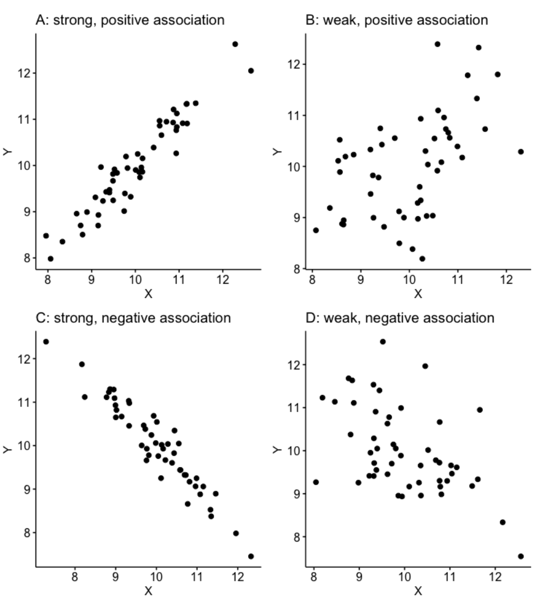
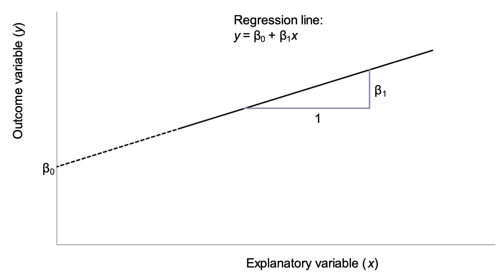

# Correlation and simple linear regression


## Learning objectives {.unnumbered}

By the end of this module you will be able to:

-   Explore the association between two continuous variables using a scatter plot;
-   Estimate and interpret correlation coefficients;
-   Estimate and interpret parameters from a simple linear regression;
-   Assess the assumptions of simple linear regression;
-   Test a hypothesis using regression coefficients.

## Optional readings {.unnumbered}

@kirkwood_sterne01; Chapter 10. [[UNSW Library Link]](http://er1.library.unsw.edu.au/er/cgi-bin/eraccess.cgi?url=https://ebookcentral.proquest.com/lib/unsw/detail.action?docID=624728)

@bland15; Chapter 11. [[UNSW Library Link]](http://er1.library.unsw.edu.au/er/cgi-bin/eraccess.cgi?url=https://ebookcentral.proquest.com/lib/unsw/detail.action?docID=5891730)

@acock10; Chapter 8.

## Introduction

In Module 5, we saw how to test whether the means from two groups are equal - in other words, whether a continuous variable is related to a categorical variable. Sometimes we are interested in how closely two continuous variables are related. For example, we may want to know how closely blood cholesterol levels are related to dietary fat intake in adult men. To measure the strength of association between two continuously distributed variables, a correlation coefficient is used.

We may also want to predict a value of a continuous measurement from another continuous measurement. For example, we may want to know predict values of lung capacity from height in a community of adults. A regression model allows us to use one measurement to predict another measurement.

Although both correlation coefficients and regression models can be used to describe the degree of association between two continuous variables, the two methods provide different information. It is important to note that both methods summarise the strength of an association between variables, and do not imply a causal relationship.

## Notation

In this module, we will be focussing on the association between two variables, denoted $x$ and $y$.

There may be cases where it does not matter which variable is denoted $x$ and which is denoted $y$, however this is rare. We are usually interested in whether one variable is associated with another. If we believe that a change in $x$ will lead to a change in $y$, or that $y$ is influenced by $x$, we define $y$ as the *outcome variable* and $x$ as the *explanatory variable*.

## Correlation

We use correlation to measure the strength of a linear relationship between two variables. Before calculating a correlation coefficient, a scatter plot should first be obtained to give an understanding of the nature of the relationship between the two variables.

### Worked Example

The file `mod08_lung_function.csv` has information about height and lung function collected from a random sample of 120 adults. Information was collected on height (cm) and lung function, which was measured as forced vital capacity (FVC), measured in litres. We can obtain a *scatter-plot* shown in @fig-scatter-plot, where the outcome variable ($y$) is plotted on the vertical axis, and the explanatory variable ($x$) is plotted on the horizontal axis. 

@fig-scatter-plot shows that as height increases, lung function also increases, which is as expected. One or two of the data points are separated from the rest of the data but are not so far away as to be considered outliers because they do not seem to stand out of other observations.


::: {.cell}
::: {.cell-output-display}
{#fig-scatter-plot}
:::
:::


### Correlation coefficients

A correlation coefficient (r) describes how closely the variables are related, that is the strength of linear association between two continuous variables. The range of the coefficient is from +1 to −1 where +1 is a perfect positive association, 0 is no association and −1 is a perfect inverse association. In general, an absolute (disregarding the sign) r value below 0.3 indicates a weak association, 0.3 to \< 0.6 is fair association, 0.6 to \< 0.8 is a moderate association, and $\ge$ 0.8 indicates a strong association.

The correlation coefficient is positive when large values of one variable tend to occur with large values of the other, and small values of one variable (y) tend to occur with small values of the other (x) (@fig-scatter-plot-four (a and b)). For example, height and weight in healthy children or age and blood pressure.

The correlation coefficient is negative when large values of one variable tend to occur with small values of the other, and small values of one variable tend to occur with large values of the other (@fig-scatter-plot-four (c and d)). For example, percentage immunised against infectious diseases and under-five mortality rate.


::: {.cell}
::: {.cell-output-display}
{#fig-scatter-plot-four width=66%}
:::
:::


It is possible to calculate a P-value associated with a correlation coefficient to test whether the correlation coefficient is different from zero. However, a correlation coefficient with a large P-value does not imply that there is no relationship between $x$ and $y$, because the correlation coefficient only tests for a linear association and there may be a non-linear relationship such as a curved or irregular relationship.

The assumptions for using a Pearson's correlation coefficient are that:

-   observations are independent;
-   both variables are continuous variables;
-   the relationship between the two variables is linear.

There is a further assumption that the data follow a bivariate normal distribution. This assumes: *y* follows a normal distribution for given values of *x*; and *x* follows a normal distribution for given values of *y*. This is quite a technical assumption that we do not discuss further.

There are two types of correlation coefficients-- the correct one to use is determined by the nature of the variables as shown in  @tbl-mod08-correlation-coefficients.


::: {#tbl-mod08-correlation-coefficients .cell tbl-cap='Correlation coefficients and their application'}
::: {.cell-output-display}

```{=latex}
\global\setlength{\Oldarrayrulewidth}{\arrayrulewidth}

\global\setlength{\Oldtabcolsep}{\tabcolsep}

\setlength{\tabcolsep}{2pt}

\renewcommand*{\arraystretch}{1.5}


\providecommand{\ascline}[3]{\noalign{\global\arrayrulewidth #1}\arrayrulecolor[HTML]{#2}\cline{#3}}

\begin{longtable}[c]{|p{2.00in}|p{4.00in}}


\ascline{1.5pt}{666666}{1-2}

\multicolumn{1}{>{\raggedright}m{\dimexpr 2in+0\tabcolsep}}{\textcolor[HTML]{000000}{\fontsize{11}{11}\selectfont{\global\setmainfont{Helvetica}{Correlation\ coefficient}}}} & \multicolumn{1}{>{\raggedright}m{\dimexpr 4in+0\tabcolsep}}{\textcolor[HTML]{000000}{\fontsize{11}{11}\selectfont{\global\setmainfont{Helvetica}{Application}}}} \\

\ascline{1.5pt}{666666}{1-2}\endfirsthead 

\ascline{1.5pt}{666666}{1-2}

\multicolumn{1}{>{\raggedright}m{\dimexpr 2in+0\tabcolsep}}{\textcolor[HTML]{000000}{\fontsize{11}{11}\selectfont{\global\setmainfont{Helvetica}{Correlation\ coefficient}}}} & \multicolumn{1}{>{\raggedright}m{\dimexpr 4in+0\tabcolsep}}{\textcolor[HTML]{000000}{\fontsize{11}{11}\selectfont{\global\setmainfont{Helvetica}{Application}}}} \\

\ascline{1.5pt}{666666}{1-2}\endhead


\multicolumn{1}{>{\raggedright}m{\dimexpr 2in+0\tabcolsep}}{\textcolor[HTML]{000000}{\fontsize{11}{11}\selectfont{\global\setmainfont{Helvetica}{Pearson’s}}}\textcolor[HTML]{000000}{\fontsize{11}{11}\selectfont{\global\setmainfont{Helvetica}{\ }}}\textcolor[HTML]{000000}{\fontsize{11}{11}\selectfont{\global\setmainfont{Helvetica}{correlation}}}\textcolor[HTML]{000000}{\fontsize{11}{11}\selectfont{\global\setmainfont{Helvetica}{\ }}}\textcolor[HTML]{000000}{\fontsize{11}{11}\selectfont{\global\setmainfont{Helvetica}{coefficient:}}}\textcolor[HTML]{000000}{\fontsize{11}{11}\selectfont{\global\setmainfont{Helvetica}{\ }}}\textcolor[HTML]{000000}{\fontsize{11}{11}\selectfont{\global\setmainfont{Helvetica}{\textit{r}}}}} & \multicolumn{1}{>{\raggedright}m{\dimexpr 4in+0\tabcolsep}}{\textcolor[HTML]{000000}{\fontsize{11}{11}\selectfont{\global\setmainfont{Helvetica}{Both}}}\textcolor[HTML]{000000}{\fontsize{11}{11}\selectfont{\global\setmainfont{Helvetica}{\ }}}\textcolor[HTML]{000000}{\fontsize{11}{11}\selectfont{\global\setmainfont{Helvetica}{variables}}}\textcolor[HTML]{000000}{\fontsize{11}{11}\selectfont{\global\setmainfont{Helvetica}{\ }}}\textcolor[HTML]{000000}{\fontsize{11}{11}\selectfont{\global\setmainfont{Helvetica}{are}}}\textcolor[HTML]{000000}{\fontsize{11}{11}\selectfont{\global\setmainfont{Helvetica}{\ }}}\textcolor[HTML]{000000}{\fontsize{11}{11}\selectfont{\global\setmainfont{Helvetica}{continuous}}}\textcolor[HTML]{000000}{\fontsize{11}{11}\selectfont{\global\setmainfont{Helvetica}{\ }}}\textcolor[HTML]{000000}{\fontsize{11}{11}\selectfont{\global\setmainfont{Helvetica}{and}}}\textcolor[HTML]{000000}{\fontsize{11}{11}\selectfont{\global\setmainfont{Helvetica}{\ }}}\textcolor[HTML]{000000}{\fontsize{11}{11}\selectfont{\global\setmainfont{Helvetica}{a}}}\textcolor[HTML]{000000}{\fontsize{11}{11}\selectfont{\global\setmainfont{Helvetica}{\ }}}\textcolor[HTML]{000000}{\fontsize{11}{11}\selectfont{\global\setmainfont{Helvetica}{bivariate}}}\textcolor[HTML]{000000}{\fontsize{11}{11}\selectfont{\global\setmainfont{Helvetica}{\ }}}\textcolor[HTML]{000000}{\fontsize{11}{11}\selectfont{\global\setmainfont{Helvetica}{normal}}}\textcolor[HTML]{000000}{\fontsize{11}{11}\selectfont{\global\setmainfont{Helvetica}{\ }}}\textcolor[HTML]{000000}{\fontsize{11}{11}\selectfont{\global\setmainfont{Helvetica}{distribution}}}\textcolor[HTML]{000000}{\fontsize{11}{11}\selectfont{\global\setmainfont{Helvetica}{\ }}}\textcolor[HTML]{000000}{\fontsize{11}{11}\selectfont{\global\setmainfont{Helvetica}{can}}}\textcolor[HTML]{000000}{\fontsize{11}{11}\selectfont{\global\setmainfont{Helvetica}{\ }}}\textcolor[HTML]{000000}{\fontsize{11}{11}\selectfont{\global\setmainfont{Helvetica}{be}}}\textcolor[HTML]{000000}{\fontsize{11}{11}\selectfont{\global\setmainfont{Helvetica}{\ }}}\textcolor[HTML]{000000}{\fontsize{11}{11}\selectfont{\global\setmainfont{Helvetica}{assumed}}}} \\


\multicolumn{1}{>{\raggedright}m{\dimexpr 2in+0\tabcolsep}}{\textcolor[HTML]{000000}{\fontsize{11}{11}\selectfont{\global\setmainfont{Helvetica}{Spearman’s}}}\textcolor[HTML]{000000}{\fontsize{11}{11}\selectfont{\global\setmainfont{Helvetica}{\ }}}\textcolor[HTML]{000000}{\fontsize{11}{11}\selectfont{\global\setmainfont{Helvetica}{rank}}}\textcolor[HTML]{000000}{\fontsize{11}{11}\selectfont{\global\setmainfont{Helvetica}{\ }}}\textcolor[HTML]{000000}{\fontsize{11}{11}\selectfont{\global\setmainfont{Helvetica}{correlation:}}}\textcolor[HTML]{000000}{\fontsize{11}{11}\selectfont{\global\setmainfont{Helvetica}{\ }}}\textcolor[HTML]{000000}{\fontsize{11}{11}\selectfont{\global\setmainfont{Helvetica}{\textit{r}}}}\textcolor[HTML]{000000}{\fontsize{11}{11}\selectfont{\global\setmainfont{Helvetica}{\textit{h}}}}\textcolor[HTML]{000000}{\fontsize{11}{11}\selectfont{\global\setmainfont{Helvetica}{\textit{o}}}}} & \multicolumn{1}{>{\raggedright}m{\dimexpr 4in+0\tabcolsep}}{\textcolor[HTML]{000000}{\fontsize{11}{11}\selectfont{\global\setmainfont{Helvetica}{Bivariate}}}\textcolor[HTML]{000000}{\fontsize{11}{11}\selectfont{\global\setmainfont{Helvetica}{\ }}}\textcolor[HTML]{000000}{\fontsize{11}{11}\selectfont{\global\setmainfont{Helvetica}{normality}}}\textcolor[HTML]{000000}{\fontsize{11}{11}\selectfont{\global\setmainfont{Helvetica}{\ }}}\textcolor[HTML]{000000}{\fontsize{11}{11}\selectfont{\global\setmainfont{Helvetica}{cannot}}}\textcolor[HTML]{000000}{\fontsize{11}{11}\selectfont{\global\setmainfont{Helvetica}{\ }}}\textcolor[HTML]{000000}{\fontsize{11}{11}\selectfont{\global\setmainfont{Helvetica}{be}}}\textcolor[HTML]{000000}{\fontsize{11}{11}\selectfont{\global\setmainfont{Helvetica}{\ }}}\textcolor[HTML]{000000}{\fontsize{11}{11}\selectfont{\global\setmainfont{Helvetica}{assumed.}}}\textcolor[HTML]{000000}{\fontsize{11}{11}\selectfont{\global\setmainfont{Helvetica}{\ }}}\textcolor[HTML]{000000}{\fontsize{11}{11}\selectfont{\global\setmainfont{Helvetica}{Also}}}\textcolor[HTML]{000000}{\fontsize{11}{11}\selectfont{\global\setmainfont{Helvetica}{\ }}}\textcolor[HTML]{000000}{\fontsize{11}{11}\selectfont{\global\setmainfont{Helvetica}{useful}}}\textcolor[HTML]{000000}{\fontsize{11}{11}\selectfont{\global\setmainfont{Helvetica}{\ }}}\textcolor[HTML]{000000}{\fontsize{11}{11}\selectfont{\global\setmainfont{Helvetica}{when}}}\textcolor[HTML]{000000}{\fontsize{11}{11}\selectfont{\global\setmainfont{Helvetica}{\ }}}\textcolor[HTML]{000000}{\fontsize{11}{11}\selectfont{\global\setmainfont{Helvetica}{at}}}\textcolor[HTML]{000000}{\fontsize{11}{11}\selectfont{\global\setmainfont{Helvetica}{\ }}}\textcolor[HTML]{000000}{\fontsize{11}{11}\selectfont{\global\setmainfont{Helvetica}{least}}}\textcolor[HTML]{000000}{\fontsize{11}{11}\selectfont{\global\setmainfont{Helvetica}{\ }}}\textcolor[HTML]{000000}{\fontsize{11}{11}\selectfont{\global\setmainfont{Helvetica}{one}}}\textcolor[HTML]{000000}{\fontsize{11}{11}\selectfont{\global\setmainfont{Helvetica}{\ }}}\textcolor[HTML]{000000}{\fontsize{11}{11}\selectfont{\global\setmainfont{Helvetica}{of}}}\textcolor[HTML]{000000}{\fontsize{11}{11}\selectfont{\global\setmainfont{Helvetica}{\ }}}\textcolor[HTML]{000000}{\fontsize{11}{11}\selectfont{\global\setmainfont{Helvetica}{the}}}\textcolor[HTML]{000000}{\fontsize{11}{11}\selectfont{\global\setmainfont{Helvetica}{\ }}}\textcolor[HTML]{000000}{\fontsize{11}{11}\selectfont{\global\setmainfont{Helvetica}{variables}}}\textcolor[HTML]{000000}{\fontsize{11}{11}\selectfont{\global\setmainfont{Helvetica}{\ }}}\textcolor[HTML]{000000}{\fontsize{11}{11}\selectfont{\global\setmainfont{Helvetica}{is}}}\textcolor[HTML]{000000}{\fontsize{11}{11}\selectfont{\global\setmainfont{Helvetica}{\ }}}\textcolor[HTML]{000000}{\fontsize{11}{11}\selectfont{\global\setmainfont{Helvetica}{ordinal}}}} \\

\ascline{1.5pt}{666666}{1-2}


\end{longtable}


\arrayrulecolor[HTML]{000000}

\global\setlength{\arrayrulewidth}{\Oldarrayrulewidth}

\global\setlength{\tabcolsep}{\Oldtabcolsep}

\renewcommand*{\arraystretch}{1}
```

:::
:::


Spearman's $\rho$ is calculated using the ranks of the data, rather than the actual values of the data. We will see further examples of such methods in Module 9, when we consider non-parametric tests, which are often based on ranks.

Correlation coefficients are often presented in the form of a *correlation matrix* which can display the correlation between a number of variables in a single table (@tbl-corrmatrix).

+------------+-------------+-------------+
|            | Height      | FVC         |
+------------+-------------+-------------+
| Height     | 1           | 0.70\       |
|            |             | P \< 0.0001 |
+------------+-------------+-------------+
| FVC        | 0.70\       | 1           |
|            | P \< 0.0001 |             |
+------------+-------------+-------------+

: Correlation matrix for Height and FVC {#tbl-corrmatrix}

This correlation matrix shows that the Pearson's correlation coefficient between height and lung function is 0.70 with P\<0.0001 indicating very strong evidence of a linear association between height and FVC. A correlation matrix sometimes includes correlations between the same variable, indicated as a correlation coefficient of 1. For example, $Height$ is perfectly correlated with itself (i.e. has a correlation coefficient of 1). Similarly, $FVC$ is perfectly correlated with itself.

Correlation coefficients are rarely used as important statistics in their own right because they do not fully explain the relationship between the two variables and the range of the data has an important influence on the size of the coefficient. In addition, the statistical significance of the correlation coefficient is often over interpreted because a small correlation which is of no clinical importance can become statistically significant even with a relatively small sample size. For example, a poor correlation of 0.3 will be statistically significant if the sample size is large enough.

## Linear regression

The nature of a relationship between two variables is more fully described using regression, where the relationship is described by a straight line.

@fig-scatter-plot-line shows our lung data with a fitted regression line.


::: {.cell}
::: {.cell-output-display}
{#fig-scatter-plot-line width=66%}
:::
:::


The line through the plot is called the line of 'best fit' because the size of the deviations between the data points and the line is minimised in estimating the line.

### Regression equations

The mathematical equation for the line explains the relationship between two variables: $y$, the outcome variable, and $x$, the explanatory variable. The equation of the regression line is as follows:

$$y = \beta_{0} + \beta_{1}x$$

This line is shown in @fig-regression-parameters using the notation shown in @tbl-regression-notation.


::: {.cell}
::: {.cell-output-display}
{#fig-regression-parameters width=66%}
:::
:::


::: {#tbl-regression-notation .cell tbl-cap='Notation for linear regression equation'}
::: {.cell-output-display}

```{=latex}
\global\setlength{\Oldarrayrulewidth}{\arrayrulewidth}

\global\setlength{\Oldtabcolsep}{\tabcolsep}

\setlength{\tabcolsep}{2pt}

\renewcommand*{\arraystretch}{1.5}


\providecommand{\ascline}[3]{\noalign{\global\arrayrulewidth #1}\arrayrulecolor[HTML]{#2}\cline{#3}}

\begin{longtable}[c]{|p{0.96in}|p{2.34in}}


\ascline{1.5pt}{666666}{1-2}

\multicolumn{1}{>{\raggedright}m{\dimexpr 0.96in+0\tabcolsep}}{\textcolor[HTML]{000000}{\fontsize{11}{11}\selectfont{\global\setmainfont{Helvetica}{Symbol}}}} & \multicolumn{1}{>{\raggedright}m{\dimexpr 2.34in+0\tabcolsep}}{\textcolor[HTML]{000000}{\fontsize{11}{11}\selectfont{\global\setmainfont{Helvetica}{Interpretation}}}} \\

\ascline{1.5pt}{666666}{1-2}\endfirsthead 

\ascline{1.5pt}{666666}{1-2}

\multicolumn{1}{>{\raggedright}m{\dimexpr 0.96in+0\tabcolsep}}{\textcolor[HTML]{000000}{\fontsize{11}{11}\selectfont{\global\setmainfont{Helvetica}{Symbol}}}} & \multicolumn{1}{>{\raggedright}m{\dimexpr 2.34in+0\tabcolsep}}{\textcolor[HTML]{000000}{\fontsize{11}{11}\selectfont{\global\setmainfont{Helvetica}{Interpretation}}}} \\

\ascline{1.5pt}{666666}{1-2}\endhead


\multicolumn{1}{>{\raggedright}m{\dimexpr 0.96in+0\tabcolsep}}{\textcolor[HTML]{000000}{\fontsize{11}{11}\selectfont{\global\setmainfont{Helvetica}{\textit{y}}}}} & \multicolumn{1}{>{\raggedright}m{\dimexpr 2.34in+0\tabcolsep}}{\textcolor[HTML]{000000}{\fontsize{11}{11}\selectfont{\global\setmainfont{Helvetica}{The}}}\textcolor[HTML]{000000}{\fontsize{11}{11}\selectfont{\global\setmainfont{Helvetica}{\ }}}\textcolor[HTML]{000000}{\fontsize{11}{11}\selectfont{\global\setmainfont{Helvetica}{outcome}}}\textcolor[HTML]{000000}{\fontsize{11}{11}\selectfont{\global\setmainfont{Helvetica}{\ }}}\textcolor[HTML]{000000}{\fontsize{11}{11}\selectfont{\global\setmainfont{Helvetica}{variable}}}} \\


\multicolumn{1}{>{\raggedright}m{\dimexpr 0.96in+0\tabcolsep}}{\textcolor[HTML]{000000}{\fontsize{11}{11}\selectfont{\global\setmainfont{Helvetica}{\textit{x}}}}} & \multicolumn{1}{>{\raggedright}m{\dimexpr 2.34in+0\tabcolsep}}{\textcolor[HTML]{000000}{\fontsize{11}{11}\selectfont{\global\setmainfont{Helvetica}{The}}}\textcolor[HTML]{000000}{\fontsize{11}{11}\selectfont{\global\setmainfont{Helvetica}{\ }}}\textcolor[HTML]{000000}{\fontsize{11}{11}\selectfont{\global\setmainfont{Helvetica}{explanatory}}}\textcolor[HTML]{000000}{\fontsize{11}{11}\selectfont{\global\setmainfont{Helvetica}{\ }}}\textcolor[HTML]{000000}{\fontsize{11}{11}\selectfont{\global\setmainfont{Helvetica}{variable}}}} \\


\multicolumn{1}{>{\raggedright}m{\dimexpr 0.96in+0\tabcolsep}}{\textcolor[HTML]{000000}{\fontsize{11}{11}\selectfont{\global\setmainfont{Helvetica}{\textit{β}}}}\textcolor[HTML]{000000}{\fontsize{11}{11}\selectfont{\global\setmainfont{Helvetica}{\textsubscript{0}}}}} & \multicolumn{1}{>{\raggedright}m{\dimexpr 2.34in+0\tabcolsep}}{\textcolor[HTML]{000000}{\fontsize{11}{11}\selectfont{\global\setmainfont{Helvetica}{Intercept}}}\textcolor[HTML]{000000}{\fontsize{11}{11}\selectfont{\global\setmainfont{Helvetica}{\ }}}\textcolor[HTML]{000000}{\fontsize{11}{11}\selectfont{\global\setmainfont{Helvetica}{of}}}\textcolor[HTML]{000000}{\fontsize{11}{11}\selectfont{\global\setmainfont{Helvetica}{\ }}}\textcolor[HTML]{000000}{\fontsize{11}{11}\selectfont{\global\setmainfont{Helvetica}{the}}}\textcolor[HTML]{000000}{\fontsize{11}{11}\selectfont{\global\setmainfont{Helvetica}{\ }}}\textcolor[HTML]{000000}{\fontsize{11}{11}\selectfont{\global\setmainfont{Helvetica}{regression}}}\textcolor[HTML]{000000}{\fontsize{11}{11}\selectfont{\global\setmainfont{Helvetica}{\ }}}\textcolor[HTML]{000000}{\fontsize{11}{11}\selectfont{\global\setmainfont{Helvetica}{line}}}} \\


\multicolumn{1}{>{\raggedright}m{\dimexpr 0.96in+0\tabcolsep}}{\textcolor[HTML]{000000}{\fontsize{11}{11}\selectfont{\global\setmainfont{Helvetica}{\textit{β}}}}\textcolor[HTML]{000000}{\fontsize{11}{11}\selectfont{\global\setmainfont{Helvetica}{\textsubscript{1}}}}} & \multicolumn{1}{>{\raggedright}m{\dimexpr 2.34in+0\tabcolsep}}{\textcolor[HTML]{000000}{\fontsize{11}{11}\selectfont{\global\setmainfont{Helvetica}{Slope}}}\textcolor[HTML]{000000}{\fontsize{11}{11}\selectfont{\global\setmainfont{Helvetica}{\ }}}\textcolor[HTML]{000000}{\fontsize{11}{11}\selectfont{\global\setmainfont{Helvetica}{of}}}\textcolor[HTML]{000000}{\fontsize{11}{11}\selectfont{\global\setmainfont{Helvetica}{\ }}}\textcolor[HTML]{000000}{\fontsize{11}{11}\selectfont{\global\setmainfont{Helvetica}{the}}}\textcolor[HTML]{000000}{\fontsize{11}{11}\selectfont{\global\setmainfont{Helvetica}{\ }}}\textcolor[HTML]{000000}{\fontsize{11}{11}\selectfont{\global\setmainfont{Helvetica}{regression}}}\textcolor[HTML]{000000}{\fontsize{11}{11}\selectfont{\global\setmainfont{Helvetica}{\ }}}\textcolor[HTML]{000000}{\fontsize{11}{11}\selectfont{\global\setmainfont{Helvetica}{line}}}} \\

\ascline{1.5pt}{666666}{1-2}


\end{longtable}


\arrayrulecolor[HTML]{000000}

\global\setlength{\arrayrulewidth}{\Oldarrayrulewidth}

\global\setlength{\tabcolsep}{\Oldtabcolsep}

\renewcommand*{\arraystretch}{1}
```

:::
:::


The intercept is the point at which the regression line intersects with the y-axis when the value of $x$ is zero. In most cases, the intercept does not have a biologically meaningful interpretation as the explanatory variable cannot take a value of zero. In our working example, the intercept is not meaningful as it is not possible for an adult to have a height of 0cm.

The slope of the line is the predicted change in the outcome variable $y$ as the explanatory explanatory variable $x$ increases by 1 unit.

An important concept is that regression predicts an expected value of $y$ given an observed value of $x$: any error around the explanatory variable is not taken into account.

## Regression coefficients: estimation

The regression parameters $\beta_{0}$ and $\beta_{1}$ are true, unknown quantities (similar to $\mu$ and $\sigma$), which are estimated using statistical software using the *method of least squares*. This method estimates the intercept and the slope, and also their variability (i.e. standard errors). Software is always used to estimate the regression parameters from a set of data.

Using the method of least squares:

- the intercept is estimated as $b_0$;
- the slope is estimated as $b_1$.

## Regression coefficients: inference

We can use the estimated regression coefficients and their variability to calculate 95% confidence intervals. Here, a t-value from a t-distribution with $n - 2$ degrees of freedom is used:

- 95% confidence interval for intercept: $b_0 \pm t_{n-2} \times SE(b_0)$
- 95% confidence interval for slope: $b_1 \pm t_{n-2} \times SE(b_1)$

Note that as the constant ($b_0$) is not often biologically plausible, the 95% confidence interval for the constant is often not reported.

The significance of the estimated slope (and less commonly, intercept) can be tested using a t-test. The null hypotheses and the alternative hypothesis for testing the slope of a simple linear regression model are:

- H~0~: $\beta_1 = 0$
- H~1~: $\beta_1 \ne 0$

To test the null hypothesis for the regression coefficient $\beta_1$, the following t-test is used:

$$t = b_1 /SE(b_1)$$

This will give a t statistic which can be referred to a t distribution with n − 2 degrees of freedom to calculate the corresponding P-value.

@tbl-estimated-regression shows the estimated regression coefficients for our working example.


::: {#tbl-estimated-regression .cell tbl-cap='Estimated regression coefficients'}
::: {.cell-output-display}

```{=latex}
\global\setlength{\Oldarrayrulewidth}{\arrayrulewidth}

\global\setlength{\Oldtabcolsep}{\tabcolsep}

\setlength{\tabcolsep}{2pt}

\renewcommand*{\arraystretch}{1.5}


\providecommand{\ascline}[3]{\noalign{\global\arrayrulewidth #1}\arrayrulecolor[HTML]{#2}\cline{#3}}

\begin{longtable}[c]{|p{0.75in}|p{0.75in}|p{0.75in}|p{1.50in}|p{0.75in}|p{2.00in}}


\ascline{1.5pt}{666666}{1-6}

\multicolumn{1}{>{\raggedright}m{\dimexpr 0.75in+0\tabcolsep}}{\textcolor[HTML]{000000}{\fontsize{11}{11}\selectfont{\global\setmainfont{Helvetica}{Term}}}} & \multicolumn{1}{>{\raggedleft}m{\dimexpr 0.75in+0\tabcolsep}}{\textcolor[HTML]{000000}{\fontsize{11}{11}\selectfont{\global\setmainfont{Helvetica}{Estimate}}}} & \multicolumn{1}{>{\raggedleft}m{\dimexpr 0.75in+0\tabcolsep}}{\textcolor[HTML]{000000}{\fontsize{11}{11}\selectfont{\global\setmainfont{Helvetica}{Standard\ error}}}} & \multicolumn{1}{>{\centering}m{\dimexpr 1.5in+0\tabcolsep}}{\textcolor[HTML]{000000}{\fontsize{11}{11}\selectfont{\global\setmainfont{Helvetica}{t\ value}}}} & \multicolumn{1}{>{\raggedright}m{\dimexpr 0.75in+0\tabcolsep}}{\textcolor[HTML]{000000}{\fontsize{11}{11}\selectfont{\global\setmainfont{Helvetica}{P\ value}}}} & \multicolumn{1}{>{\centering}m{\dimexpr 2in+0\tabcolsep}}{\textcolor[HTML]{000000}{\fontsize{11}{11}\selectfont{\global\setmainfont{Helvetica}{95\%\ Confidence\ interval}}}} \\

\ascline{1.5pt}{666666}{1-6}\endfirsthead 

\ascline{1.5pt}{666666}{1-6}

\multicolumn{1}{>{\raggedright}m{\dimexpr 0.75in+0\tabcolsep}}{\textcolor[HTML]{000000}{\fontsize{11}{11}\selectfont{\global\setmainfont{Helvetica}{Term}}}} & \multicolumn{1}{>{\raggedleft}m{\dimexpr 0.75in+0\tabcolsep}}{\textcolor[HTML]{000000}{\fontsize{11}{11}\selectfont{\global\setmainfont{Helvetica}{Estimate}}}} & \multicolumn{1}{>{\raggedleft}m{\dimexpr 0.75in+0\tabcolsep}}{\textcolor[HTML]{000000}{\fontsize{11}{11}\selectfont{\global\setmainfont{Helvetica}{Standard\ error}}}} & \multicolumn{1}{>{\centering}m{\dimexpr 1.5in+0\tabcolsep}}{\textcolor[HTML]{000000}{\fontsize{11}{11}\selectfont{\global\setmainfont{Helvetica}{t\ value}}}} & \multicolumn{1}{>{\raggedright}m{\dimexpr 0.75in+0\tabcolsep}}{\textcolor[HTML]{000000}{\fontsize{11}{11}\selectfont{\global\setmainfont{Helvetica}{P\ value}}}} & \multicolumn{1}{>{\centering}m{\dimexpr 2in+0\tabcolsep}}{\textcolor[HTML]{000000}{\fontsize{11}{11}\selectfont{\global\setmainfont{Helvetica}{95\%\ Confidence\ interval}}}} \\

\ascline{1.5pt}{666666}{1-6}\endhead


\multicolumn{1}{>{\raggedright}m{\dimexpr 0.75in+0\tabcolsep}}{\textcolor[HTML]{000000}{\fontsize{11}{11}\selectfont{\global\setmainfont{Helvetica}{Intercept}}}} & \multicolumn{1}{>{\raggedleft}m{\dimexpr 0.75in+0\tabcolsep}}{\textcolor[HTML]{000000}{\fontsize{11}{11}\selectfont{\global\setmainfont{Helvetica}{-18.87}}}} & \multicolumn{1}{>{\raggedleft}m{\dimexpr 0.75in+0\tabcolsep}}{\textcolor[HTML]{000000}{\fontsize{11}{11}\selectfont{\global\setmainfont{Helvetica}{2.194}}}} & \multicolumn{1}{>{\centering}m{\dimexpr 1.5in+0\tabcolsep}}{\textcolor[HTML]{000000}{\fontsize{11}{11}\selectfont{\global\setmainfont{Helvetica}{t=-8.60,\ 118df}}}} & \multicolumn{1}{>{\raggedright}m{\dimexpr 0.75in+0\tabcolsep}}{\textcolor[HTML]{000000}{\fontsize{11}{11}\selectfont{\global\setmainfont{Helvetica}{<0.001}}}} & \multicolumn{1}{>{\centering}m{\dimexpr 2in+0\tabcolsep}}{\textcolor[HTML]{000000}{\fontsize{11}{11}\selectfont{\global\setmainfont{Helvetica}{-23.22\ to\ -14.53}}}} \\


\multicolumn{1}{>{\raggedright}m{\dimexpr 0.75in+0\tabcolsep}}{\textcolor[HTML]{000000}{\fontsize{11}{11}\selectfont{\global\setmainfont{Helvetica}{Height}}}} & \multicolumn{1}{>{\raggedleft}m{\dimexpr 0.75in+0\tabcolsep}}{\textcolor[HTML]{000000}{\fontsize{11}{11}\selectfont{\global\setmainfont{Helvetica}{0.14}}}} & \multicolumn{1}{>{\raggedleft}m{\dimexpr 0.75in+0\tabcolsep}}{\textcolor[HTML]{000000}{\fontsize{11}{11}\selectfont{\global\setmainfont{Helvetica}{0.013}}}} & \multicolumn{1}{>{\centering}m{\dimexpr 1.5in+0\tabcolsep}}{\textcolor[HTML]{000000}{\fontsize{11}{11}\selectfont{\global\setmainfont{Helvetica}{t=10.58,\ 118df}}}} & \multicolumn{1}{>{\raggedright}m{\dimexpr 0.75in+0\tabcolsep}}{\textcolor[HTML]{000000}{\fontsize{11}{11}\selectfont{\global\setmainfont{Helvetica}{<0.001}}}} & \multicolumn{1}{>{\centering}m{\dimexpr 2in+0\tabcolsep}}{\textcolor[HTML]{000000}{\fontsize{11}{11}\selectfont{\global\setmainfont{Helvetica}{0.11\ to\ 0.17}}}} \\

\ascline{1.5pt}{666666}{1-6}


\end{longtable}


\arrayrulecolor[HTML]{000000}

\global\setlength{\arrayrulewidth}{\Oldarrayrulewidth}

\global\setlength{\tabcolsep}{\Oldtabcolsep}

\renewcommand*{\arraystretch}{1}
```

:::
:::


From this output, we see that the slope is estimated as 0.14 with an estimated intercept of -18.87. Therefore, the regression equation is estimated as:

FVC (L) = − 18.87 + (0.14 $\times$ Height in cm)

There is very strong evidence of a linear association between FVC and height in cm (P \< 0.001).

This equation can be used to predict FVC for a person of a given height. For example, the predicted FVC for a person 165 cm tall is estimated as:

FVC = − 18.87347 + (0.1407567 $\times$ 165.0) = 4.40 L.

Note that for the purpose of prediction we have kept all the decimal places in the coefficients to avoid rounding error in the intermediate calculation.


### Fit of a linear regression model

After fitting a linear regression model, it is important to know how well the model fits the observed data. One way of assessing the model fit is to compute a statistic called coefficient of determination, denoted by $R^2$. It is the square of the Pearson correlation coefficient $r: r^2 = R^2$. Since the range of $r$ is from −1 to 1, $R^2$ must lie between 0 and 1.

$R^2$ can be interpreted as the proportion of variability in y that can be explained by variability in x. Hence, the following conditions may arise:

If $R^2 = 1$, then all variation in y can be explained by variation of x and all data points fall on the regression line.

If $R^2 = 0$, then none of the variation in y is related to x at all, and the variable x explains none of the variability in y.

If $0 < R^2 <1$, then the variability of y can be partially explained by the variability in x. The larger the $R^2$ value, the better is the fit of the regression model.

## Assumptions for linear regression

Regression is robust to moderate degrees of non-normality in the variables, provided that the sample size is large enough and that there are no influential outliers. Also, the regression equation describes the relationship between the variables and this is not influenced as much by the spread of the data as the correlation coefficient is.

The assumptions that must be met when using linear regression are as follows:

-   observations are independent;
-   the relationship between the explanatory and the outcome variable is linear;
-   the residuals are normally distributed.

A residual is defined as the difference between the observed and predicted outcome from the regression model. If the predicted value of the outcome variable is denoted by $\hat y$ then:

$$ \text{Residual} = \text{observed} - \text{predicted} = y - \hat y$$

It is important for regression modelling that the data are collected in a period when the relationship remains constant. For example, in building a model to predict normal values for lung function the data must be collected when the participants have been resting and not exercising and people taking bronchodilator medications that influence lung capacity should be excluded. In regression, it is not so important that the variables themselves are normally distributed, but it is important that the residuals are. Scatter plots and specific diagnostic tests can be used to check the regression assumptions. Some of these will not be covered in this introductory course but will be discussed in detail in the **Regression Methods in Biostatistics** course.

The distribution of the residuals should always be checked. Large residuals can indicate unusual points or points that may exert undue influence on the estimated regression slope.

The distribution of the residuals from the model is shown in @fig-residual-dist. The residuals are approximately normally distributed, with no outlying values.


::: {.cell}
::: {.cell-output-display}
{#fig-residual-dist width=66%}
:::
:::


## Multiple linear regression

In the above example, we have only used a simple linear regression model of two continuous variables. Other more complex models can be built from this e.g. if we wanted to look at the effect of gender (male vs. female) as binary indicator in the model while adjusting for the effect of height. In that case we would include both the variables in the model as explanatory variables. In the same way we can include any number of explanatory variables (both continuous and categorical) in the model: this is called a multivariable model. Multivariable models are often used for building predictive equations, for example by using age, height, gender and smoking history to predict lung function, or to adjust for confounding and detect effect modification to investigate the association between an exposure and an outcome factor.

Multiple regression has an important role in investigating causality in epidemiology. The exposure variable under investigation must stay in the model and the effects of other variables which can be confounders or effect-modifiers are tested. The biological, psychological or social meaning of the variables in the model and their interactions are of great importance for interpreting theories of causality.

Other multivariable models include binary logistic regression for use with a binary outcome variable, or Cox regression for survival analyses. These models, together with multiple regression, will be taught in **PHCM9517: Regression Methods in Biostatistics**.


<!--  -->

<!-- # Jamovi notes {-} -->

<!--  -->

<!-- <!--  --> -->

<!-- # R notes {-} -->

<!--  -->

<!--  -->

<!-- # Activities {-} -->

<!--  -->
